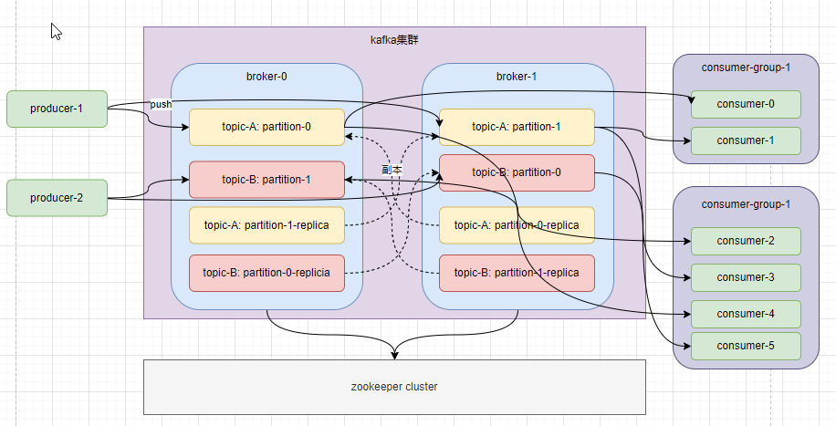
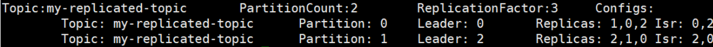

# 1 kafka搭建常用命令

=======

## 1.1 kafka单机搭建和配置

    kafka搭建需要依赖jdk和zookeeper，其中jdk必装zookeeper可以使用kafka集成的，也可以单独安装。这里跳过jdk安装和zookeeper安装。

    安装kafka非常简单，将tar包复制到指定的目录，进行解压即可。

    kafka配置，kafka配置目录为server.properties

```properties
# kafka服务唯一id,集群中每个装有kafka的机器都是一个broker，每个broker的唯一id
broker.id=0
# 访问许可，如果kafka服务需要被外部主机访问到需要配置
listeners=PLAINTEXT://192.168.56.11:9092

num.network.threads=3

num.io.threads=8

socket.send.buffer.bytes=102400

socket.receive.buffer.bytes=102400

socket.request.max.bytes=104857600
# kafka数据存储目录
log.dirs=/tmp/kafka-logs
# topic默认分区数
num.partitions=1

num.recovery.threads.per.data.dir=1
# 分区默认副本因子（分区的存储份数）
offsets.topic.replication.factor=1
transaction.state.log.replication.factor=1
transaction.state.log.min.isr=1
####### record保留策略 ###########
# kafka record默认存储时间，过了时间会被删除
log.retention.hours=168

log.retention.check.interval.ms=300000
# zookeeper配置，集群配置localhost:2181;localhost:2182;localhost:2183
zookeeper.connect=localhost:2181

zookeeper.connection.timeout.ms=18000

group.initial.rebalance.delay.ms=0
```

    启动kafka服务，在启动kafka服务之前需要先启动zookeeper。

```shell
./kafka­-server­start.sh [-daemon] ../config/server.properties
```

    停止kafka服务

```shell
./kafka-server-stop.sh
```

## 1.2 kafka客户端API常用命令

1. 创建一个名为test-topic主题，且主题只有一个分区，一个备份

```shell
./kafka-topics.sh --create bootstrap-server 192.168.56.11:9092\
--replication-factor 1 --partitions 1 --topic test-topic
```

2. 查看创建的topic信息

```shell
./kafka-topics.sh --describe --topic test-topic \
--bootstrap-server 192.168.56.11:9092
```

3. 发送消息到test-topic主题（kafka提供了命令行工具，可以输入文件或命令行中读取消息发送到kafka集群，每一行是一条消息）

```shell
./kafka-console-producer.sh --broker-list 192.168.56.11:9092 --topic test-topic
```

4. 消费消息（kafka提供了消费消息的命令行工具，将存储的消息输出出来）

```shell
# 消费消息
./kafka-console-consumer.sh --bootstrap-server 192.168.56.11:9092 --topic test-topic \
--from-beginning

# 消费多个主题
kafka‐console‐consumer.sh ‐‐bootstrap‐server 192.168.56.11:9092 ‐‐whitelist "test|test‐2"

# 给消费者绑定消费组
./kafka‐console‐consumer.sh ‐‐bootstrap‐server 192.168.56.11:9092 ‐‐consumer‐property group.id=testGroup ‐‐topic t
et
```

    --from-beginning：参数希望消费者从头开始消费，如果不指定则消费者从下一条消息开始消费。

5. 查看当前Kafka存在的topic

```shell
./kafka-topics.sh --list --bootstrap-server 192.168.56.11:9092
```

6. 删除topic

```shell
./kafka-topics.sh --delete --topic test-topic --bootstrap-server 192.168.56.11:9092
```

7. 消费组命令

```shell
# 查看消费组列表
./bin/kafka‐consumer‐groups.sh ‐‐bootstrap‐server 192.168.56.11:9092 ‐‐list

# 查看消费组的消费偏移量
./kafka‐consumer‐groups.sh ‐‐bootstrap‐server 192.168.65.11:9092 ‐‐describe ‐‐group testGroup
```

# 2 kafka核心架构



## 2.1 kafka中术语

| 术语            | 注释                                                                                            |
| ------------- | --------------------------------------------------------------------------------------------- |
| Broker        | 集群中每一台装有kafka的机器称为broker                                                                      |
| Topic         | 每次发送消息都要指定一个Topic，用于对消息进行分类，是一个逻辑概念                                                           |
| Partition     | 真正存储消息的容器，一个topic可以分为多个partition，会保证每个partition中的消息有序，是一个物理概念                                 |
| Producer      | 生产消息的生产者                                                                                      |
| Consumer      | 用于消费消息的消费者                                                                                    |
| ConsumerGroup | 消费组，每一个consumer都要指定一个consumer group，一个消息可以被多个不同的consumer组消费，但是一个consumer group指定有一个consumer消费 |
| Record        | kafka中也将消息称为Record 记录                                                                         |

## 2.2 Topic和Partition

kafka中topic是对消费的分类，可以将同一类型的消息发布到统一的Topic中。每个Topic中都有一个或多个Partition。

partition是真正存储数据的容器，partition是一个有序的message列表，partiton中的每个消息都有唯一的编号，称为offset。每个partition保证有序。每个partition对应一个commit log文件，用于存partition中的数据。

集群模式下，同一个topic中的partition会存储在不同的broker中，并且会有备份，提高容灾能力。如下：



主题my-replicated-topic 有两个partition，partition-0 partition-1；并且每个partition有3个副本。Leader表示partition-0 存储在0节点，partition-1存储在2节点。replicas表示partition的副本存储几点，Isr是replicas的子集，表示当前还存活的，并且已经同步备份的节点。

> 只有leader节点才提供读写操作

## 2.3 Consumer

kafka中每个consumer都是基于自己在commit log中的消费进度工作的，消费进度offset由consumer自己来维护，一般情况下，我们是逐条消费commit log中的消息，也客户通过指定offset来重复消费某些，或者跳过某些消息。

这种模式意味着kafka中consumer对集群的影响非常小，添加多个或减少多个consumer对集群来说没有影响，应为consumer的消费进度由自己保存。

## 2.4 持久化

kafka一般不会删除消息，无论消息是否被消费。只会根据配置的日志保留时间（log.retention.hours）确认多久后删除日志，默认保留一周。kafka的性能与保留的消息数据量没有关系。

## 2.5 消费模式

kafka中消息消费模式有两种：一种是单播消费，一种是多播消费。

单播消费：一条消息只能被 一个消费者消费一次的模式，kafka只允许同一条消息被同一个消费组中的一个消费者消费。所以只需要保证消费者在一个消费组中就为单播消费。

多播消费：一条消息可以被多个消费者消费的模式，实现多播，只需要保证消费者属于不同的消费者即可。

# 3 Java API使用

### 3.1 Producer

```java
package com.kafka.producer;

import com.kafka.Constant;
import lombok.extern.slf4j.Slf4j;
import org.apache.kafka.clients.producer.KafkaProducer;
import org.apache.kafka.clients.producer.ProducerConfig;
import org.apache.kafka.clients.producer.ProducerRecord;
import org.apache.kafka.common.serialization.StringDeserializer;
import org.apache.kafka.common.serialization.StringSerializer;

import java.util.Properties;
import java.util.concurrent.CountDownLatch;

/**
 * kafka生产者生成记录
 * kafka生产者是线程安全的，在线程之间共享单个实例
 *
 * @author zhaixinwei
 * @date 2022/10/14
 */
@Slf4j
public class Producer {

    /**
     * 向kafka中发送 记录
     */
    public void sendRecord() throws InterruptedException {
        // 生产者配置
        Properties properties = new Properties();
        properties.put(ProducerConfig.BOOTSTRAP_SERVERS_CONFIG, "192.168.56.11:9092");
        /*
          发出消息持久化机制参数
        （1）acks=0： 表示producer不需要等待任何broker确认收到消息的回复，就可以继续发送下一条消息。性能最高，但是最容易丢消息。
        （2）acks=1： 至少要等待leader已经成功将数据写入本地log，但是不需要等待所有follower是否成功写入。就可以继续发送下一
        条消息。这种情况下，如果follower没有成功备份数据，而此时leader又挂掉，则消息会丢失。
        （3）acks=‐1或all： 需要等待 min.insync.replicas(默认为1，推荐配置大于等于2) 这个参数配置的副本个数都成功写入日志，这种策
        略会保证
         只要有一个备份存活就不会丢失数据。这是最强的数据保证。一般除非是金融级别，或跟钱打交道的场景才会使用这种配置。
        */
        properties.put(ProducerConfig.ACKS_CONFIGACKS_CONFIGACKS_CONFIG, "all");
        /*
        发送失败会重试，默认重试间隔100ms，重试能保证消息发送的可靠性，但是也可能造成消息重复发送，比如网络抖动，所以需要在
        接收者那边做好消息接收的幂等性处理
         */
        properties.put(ProducerConfig.RETRIES_CONFIG, 100);
        //kafka本地线程会从缓冲区取数据，批量发送到broker，
        // 设置批量发送消息的大小，默认值是16384，即16kb，就是说一个batch满了16kb就发送出去
        properties.put(ProducerConfig.BATCH_SIZE_CONFIG, 16384);
        /*
        默认值是0，意思就是消息必须立即被发送，但这样会影响性能
        一般设置10毫秒左右，就是说这个消息发送完后会进入本地的一个batch，如果10毫秒内，这个batch满了16kb就会随batch一起被发送出去
        如果10毫秒内，batch没满，那么也必须把消息发送出去，不能让消息的发送延迟时间太长
         */
        properties.put(ProducerConfig.LINGER_MS_CONFIG, 10);
        // 设置发送消息的本地缓冲区，如果设置了该缓冲区，消息会先发送到本地缓冲区，可以提高消息发送性能，默认值是33554432，即32MB
        properties.put(ProducerConfig.BUFFER_MEMORY_CONFIG, 33554432);
        properties.put(ProducerConfig.KEY_SERIALIZER_CLASS_CONFIG, StringSerializer.class.getName());
        properties.put(ProducerConfig.VALUE_SERIALIZER_CLASS_CONFIG, StringSerializer.class.getName());
        // 创建一个kafka生产者
        Producer<String, String> producer = new KafkaProducer<>(properties);

        CountDownLatch countDownLatch = new CountDownLatch(100);
        for (int i = 0; i < 100; i++) {
            // 构造消息记录
            /*
             1.指定消息发送到的分区
             ProducerRecord<String, String> record = new ProducerRecord<>(Constant.TOPIC_TEST, 0,Integer.toString(i), Integer.toString(i));
             */
            // 2.不指定消息发送到的分区，具体发送的分区计算公式：hash(key)%partitionNum
            ProducerRecord<String, String> record = new ProducerRecord<>(Constant.TOPIC_TEST, Integer.toString(i), Integer.toString(i));

            // 发布消息并接收返回值
            /*
            1. 同步阻塞接收，消息的发送是异步的，但是Future的get方法是同步阻塞的
               Future<RecordMetadata> send = producer.send(record);
             */

            // 2. 异步发送接口
            producer.send(record, (recordMetadata, e) -> {
                if (e != null) {
                    log.error("发送消息失败{}", e.getMessage());
                }else {
                    log.info("发送消息成功{}",record);
                }
                countDownLatch.countDown();
            });
        }
        countDownLatch.await();
        producer.close();
    }
}
```

生产者中需要重点关注的参数

1. ACKS_CONFIG：用于配置生产者发送后，确认消息的机制。有3种策略可以配置。
   
   - acks = 0：表示producer不需要broker发送的任何消息发送成功确认，就可以继续发送其他消息。
   
   - acks = 1: 至少要等待leader已经成功将数据写入本地log，但是不需要等待所有follower是否成功写入。就可以继续发送下一条消息。这种情况下，如果follower没有成功备份数据，而此时leader又挂掉，则消息会丢失。
   
   - acks = -1: 需要等待 min.insync.replicas(默认为1，推荐配置大于等于2) 这个参数配置的副本个数都成功写入日志，这种策略会保证只要有一个备份存活就不会丢失数据。这是最强的数据保证。一般除非是金融级别，或跟钱打交道的场景才会使用这种配置。

2. RETRIES_CONFIG: 消息发送失败重试间隔配置。发送失败会重试，默认重试间隔100ms，重试能保证消息发送的可靠性，但是也可能造成消息重复发送，比如网络抖动，所以需要在 接收者那边做好消息接收的幂等性处理。

3. kafka为了提高消息发送的效率，设置了消息缓存区。
   
   - BUFFER_MEMORY_CONFIG：本地缓冲区大小，默认值33554432，32M。producer生产的消息会先存储在本地缓冲区中。
   
   - BATCH_SIZE_CONFIG：批量发送消息大小，1638，默认值16kb。kafka会从 本地缓冲区中 获取batch(消息) 发送到broker。
   
   - LINGER_MS_CONFIG: batch发送时间，默认值为0，也就是立即发送，效率较低。该配置与BATCH_SIZE_CONFIG配合使用，如果在配置的LINGER_MS_CONFIG时间内batch没有装满16kb，也会发送消息到broker。

### 3.2 Consumer

```java
package com.kafka.consumer;

import com.kafka.Constant;
import lombok.extern.slf4j.Slf4j;
import org.apache.kafka.clients.consumer.*;
import org.apache.kafka.common.PartitionInfo;
import org.apache.kafka.common.TopicPartition;
import org.apache.kafka.common.serialization.StringDeserializer;

import java.time.Duration;
import java.util.*;

/**
 * kafka消费者
 *
 * @author zhaixinwei
 * @date 2022/10/17
 */
@Slf4j()
public class Consumer {

    private final static String CONSUMER_GROUP_NAME = "test-group";

    public void consume() {

        Properties properties = new Properties();
        properties.put(ConsumerConfig.BOOTSTRAP_SERVERS_CONFIG, "192.168.56.11:9092");
        properties.put(ConsumerConfig.GROUP_ID_CONFIG, CONSUMER_GROUP_NAME);
        // 是否自动提交offset，默认就是true
        properties.setProperty(ConsumerConfig.ENABLE_AUTO_COMMIT_CONFIG, "false");
        // 自动提交offset的间隔时间
//        properties.setProperty(ConsumerConfig.AUTO_COMMIT_INTERVAL_MS_CONFIG, "10");

        /*
          当消费主题的是一个新的消费组，或者指定offset的消费方式，offset不存在，那么应该如何消费
          latest(默认) ：只消费自己启动之后发送到主题的消息
          earliest：第一次从头开始消费，以后按照消费offset记录继续消费，这个需要区别于consumer.seekToBeginning(每次都从头开始消费)
          properties.put(ConsumerConfig.AUTO_OFFSET_RESET_CONFIG, "earliest")
        */

        /*
           consumer给broker发送心跳的间隔时间，broker接收到心跳如果此时有rebalance发生会通过心跳响应将
           rebalance方案下发给consumer，这个时间可以稍微短一点
        */
//        properties.put(ConsumerConfig.HEARTBEAT_INTERVAL_MS_CONFIG, 1000);
        /*
           服务端broker多久感知不到一个consumer心跳就认为他故障了，会将其踢出消费组，
           对应的Partition也会被重新分配给其他consumer，默认是10秒
        */
//        properties.put(ConsumerConfig.SESSION_TIMEOUT_MS_CONFIG, 10 * 1000);
        // 一次poll最大拉取消息的条数，如果消费者处理速度很快，可以设置大点，如果处理速度一般，可以设置小点
//        properties.put(ConsumerConfig.MAX_POLL_RECORDS_CONFIG, 500);
        /*
         如果两次poll操作间隔超过了这个时间，broker就会认为这个consumer处理能力太弱，
         会将其踢出消费组，将分区分配给别的consumer消费
        */
//        properties.put(ConsumerConfig.MAX_POLL_INTERVAL_MS_CONFIG, 30 * 1000);
        properties.put(ConsumerConfig.KEY_DESERIALIZER_CLASS_CONFIG, StringDeserializer.class.getName());
        properties.put(ConsumerConfig.VALUE_DESERIALIZER_CLASS_CONFIG, StringDeserializer.class.getName());

        KafkaConsumer<String, String> consumer = new KafkaConsumer<>(properties);
        // 消费者订阅topic
        consumer.subscribe(Collections.singletonList(Constant.TOPIC_TEST));
        // 消费指定分区
//        consumer.assign(Collections.singletonList(new TopicPartition(Constant.TOPIC_TEST, 0)));
        // 回溯消费，从头开始消费
//        consumer.assign(Collections.singletonList(new TopicPartition(Constant.TOPIC_TEST,0)));
//        consumer.seekToBeginning(Collections.singletonList(new TopicPartition(Constant.TOPIC_TEST,0)));

        // 指定offset消费
//        consumer.assign(Collections.singletonList(new TopicPartition(Constant.TOPIC_TEST,0)));
//        consumer.seek(new TopicPartition(Constant.TOPIC_TEST,0),10);

        /*
         指定时间点消费
         实现原理
         */

        // 获取topic所以分区
        List<PartitionInfo> partitionInfos = consumer.partitionsFor(Constant.TOPIC_TEST);
        // 从1小时前开始消费
        long fetchDataTime = new Date().getTime() - 1000 * 10 * 10;
        Map<TopicPartition, Long> topicPartitionMap = new HashMap<>();
        for (PartitionInfo partitionInfo : partitionInfos) {
            topicPartitionMap.put(new TopicPartition(Constant.TOPIC_TEST, partitionInfo.partition()), fetchDataTime);
        }
        // 获取每个分区指定时间的offset
        Map<TopicPartition, OffsetAndTimestamp> offsetMap = consumer.offsetsForTimes(topicPartitionMap);
        for (Map.Entry<TopicPartition, OffsetAndTimestamp> entry : offsetMap.entrySet()) {
            TopicPartition key = entry.getKey();
            OffsetAndTimestamp value = entry.getValue();
            if (key == null || value == null) {
                continue;
            }
            log.info("partition" + key.partition() + "offset-" + value.offset());
            // 根据消费里的timestamp确定offset
            consumer.assign(Collections.singletonList(key));
            consumer.seek(key, value.offset());
        }

        while (true) {
            // 去broker拉取记录，拉取时间1s
            ConsumerRecords<String, String> records = consumer.poll(Duration.ofMillis(100));
            for (ConsumerRecord<String, String> record : records) {
                log.info("消费消息：{}", record);
            }
            if (records.count() > 0) {
                consumer.commitAsync();
            }
        }
    }
}
```

## 3.3 Springboot整合Kafka

1. 引入maven依赖

```xml
<dependency>
    <groupId>org.springframework.kafka</groupId>
    <artifactId>spring-kafka</artifactId>
</dependency>
```

2. application.yml配置文件

```yaml
spring:
  kafka:
    # kafka 服务地址
    bootstrap-servers: 192.168.56.11:9092
    # 配置中可以配置producer consumer的默认信息，如果在业务代码中重新指定配置会覆盖默认
    # 生产者默认配置
    producer:
      acks: 1 # 消息确认机制
      retries: 3 # 失败重试次数
      batch-size: 16384
      buffer-memory: 33554432
    # 消费者默认配置
    consumer:
      group-id: DEFAULT_GROUP # 消费者默认组
      enable-auto-commit: false # 关闭消息自动提交
      auto-offset-reset: earliest # 设置新消费者|offset未知时 消费策略
    listener:
      # ack-mode 消息确认机制
      # record:当每一条记录被消费者监听器处理之后提交
      # batch:当每一批poll()的数据被消费者监听器处理之后提交
      # time:当每一批poll()的数据被消费者监听器处理之后，距离上次提交时间大于TIME时提交
      # count:当每一批poll()的数据被消费者监听器处理之后，被处理record梳理大于等于count时提交
      # count_time:time | count满足一条条件时提交
      # manual:当每一批poll()的数据被消费者监听器处理后，手动调用Acknowledgment.acknowledge()后提交
      # manual_immediate:手动调用acknowledgment.acknowledge()后立即提交
      ack-mode: manual_immediate
```

3. Producer

```java
package com.kafka.producer;

import com.kafka.constant.TopicsConstant;
import org.springframework.kafka.core.KafkaTemplate;
import org.springframework.kafka.support.SendResult;
import org.springframework.stereotype.Component;
import org.springframework.util.concurrent.ListenableFuture;

import javax.annotation.Resource;

/**
 * @author zxwin
 * @date 2022/10/20
 */
@Component
public class Producer {

    @Resource
    private KafkaTemplate<String,String> kafkaTemplate;

    public void sendRecord(){
        // 发送消息，阻塞接收返回值
        ListenableFuture<SendResult<String, String>> result = kafkaTemplate.send(TopicsConstant.TEST_TOPIC, "1",
                "springboot send kafka message");
    }
}
```

4. Consumer

```java
package com.kafka.comsumer;

import com.kafka.constant.TopicsConstant;
import lombok.extern.slf4j.Slf4j;
import org.apache.kafka.clients.consumer.ConsumerRecord;
import org.springframework.kafka.annotation.KafkaListener;
import org.springframework.kafka.support.Acknowledgment;
import org.springframework.stereotype.Component;

/**
 * @author zxwin
 * @date 2022/10/21
 */
@Component
@Slf4j
public class Consumer {

    @KafkaListener(topics = TopicsConstant.TEST_TOPIC, groupId = "spring-boot-test-group", concurrency = "1")
    public void listenTestTopic(ConsumerRecord<String, String> record, Acknowledgment ack) {
        String value = record.value();
        log.info("consume record :{}", value);
        ack.acknowledge();
    }
}
```
