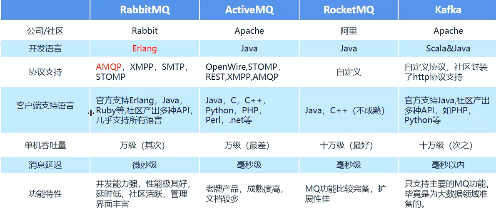

# MQ简介

## 1 MQ介绍

    MQ（message queue）消息队列。用于分布式系统之间的通信，是在消息传输过程中保存消息的容器。

## 2 MQ的优势

1. 应用解耦：在分布式系统中，往往需要多个服务配合才能实现业务，如果一个服务强依赖于其他服务的响应，那么需要使用http通信框架，这种方式往往是耦合的，一个服务出现问题其他服务也不能正常运行，容错性低。对于一些服务并非强耦合其他服务，可以使用MQ进行通信，达到解耦目的。

2. 异步提速：使用MQ后，调用其他服务不需要等待其他服务执行完成，只需要等待将消息发送到MQ中，就可以进行执行其它内容。

3. 流量削峰：借助MQ优秀的并发处理能力，将超出系统并发能力的请求存储在MQ中，依 次从MQ获取请求处理。

## 3 常见的MQ产品

