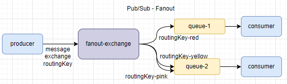
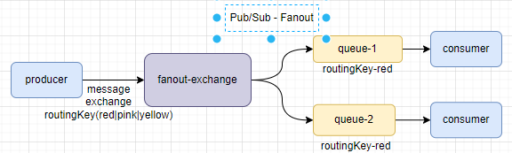
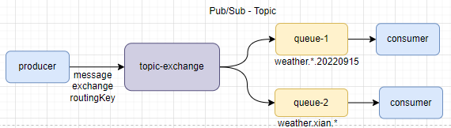

# RabbitMQ

## 1. RabbitMQ简介

    rabbitMQ是由rabbit技术公司基于AMQP标准开发的，采用Erlang语言开发， AMQP协议（Advanced Message Queuing Protocol）高级消息队列协议，是一个网络协议。

## 2. RabbitMQ安装

### 2.1 单机版

    基于Docker安装RabbitMQ单机版。需要pull RabbitMQ镜像，尽量选择management版本，例如` rabbitmq:3.9.22-management`  功能齐全，带web管理。

    如果需要挂载数据目录，数据目录/var/lib/rabbitmq

    pull镜像后，创建并启动容器，使用`docker ps` 查看是否启动成功，如果启动失败使用`docker logs -f container-name` 查看启动日志。 

```shell
docker run --name dc-rabbitmq --hostname=rabbitmq \
-p 5672:5672 -p 15672:15672 -itd \
-e RABBITMQ_DEFAULT_USER=rabbit \
-e RABBITMQ_DEFAULT_PASS=rabbit \
-v /tmp/volume/rabbitmq/data:/var/lib/rabbitmq \
rabbitmq:3.9.22-management 
```

   端口映射，5672是rabbitmq的服务端口号，15672是web管理界面端口号。

## 3 RabbitMQ架构

  rabbitMQ基本架构如下图：


- channel：是用来操作MQ的工具，可以创建队列，发布消息等。

- exchange：交换机，用来将消息路由到对应的queue。有3种类的交换机。

- queue：消息缓存区域。

- virtural host：虚拟主机，对queue，exchange资源的逻辑分组，可以理解为不同的库。

## 4 消息模型

    rabbitMQ常用的有5种消息模型，可以根据不同的业务场景选择不同的模型。包括：基本消息队列、工作消息队列、发布订阅模型。发布订阅又根据exchange不同分为 fanout 、direct、topic。

### 4.1 基本消息队列模型

    基本消息队列模型basicQueue，只包含3个角色 producer，consumer，queue，并且只有一消费者和生产者。该模型比较简单，使用场景也非常少。


    basicQueue用实例：

    公共操作，用户获取rabbitMQ connction的操作

```java
public class RabbitConnection{

    private static final Connection CONNECTION;

    private static final String USERNAME = "rabbit";

    private static final String PASSWORD = "rabbit";

    private static final String RABBIT_HOST = "192.168.56.11";

    private static final int PORT = 5672;
    static {
        ConnectionFactory connectionFactory = new ConnectionFactory();
        connectionFactory.setHost(RABBIT_HOST);
        connectionFactory.setPort(PORT);
        connectionFactory.setUsername(USERNAME);
        connectionFactory.setPassword(PASSWORD);
        Connection connection = null;
        try {
            // 获取TCP长连接
            connection = connectionFactory.newConnection();
        } catch (IOException | TimeoutException e) {
            e.printStackTrace();
        }
        CONNECTION = connection;

    }
    public static Connection getRabbitConnection(){
        return CONNECTION;
    }
}
```

    生产者实例：

```java
@Slf4j
public class BasicQueueProducer {

    public void sendBasic() throws IOException, TimeoutException {
        // 获取rabbit连接
        Connection connection = RabbitConnection.getRabbitConnection();
        // 创建虚拟连接
        Channel channel = connection.createChannel();
        /*
        创建队列
        参数一：队列名称
        参数二：持久化
        参数三：是否队列私有化，false代表所有消费者都可以访问，true代表只有第一个消费者才能一直访问
        参数四：是否自动删除，false代表连接停掉不会删除队列
         */
        channel.queueDeclare("basic_que", false, false, false, null);
        String message = "basic message";
        // 发布消息，不需要指定交换机，mq会提供默认的交换机处理
        channel.basicPublish("", "basic_que", null, message.getBytes());
        log.info("basic消息发送成功");
        channel.close();
        connection.close();
    }
}
```

    消费者实例：

```java
@Slf4j
public class BasicQueueConsumer {

    public void pullBasic() throws IOException, TimeoutException {
        Connection connection = RabbitConnection.getRabbitConnection();
        Channel channel = connection.createChannel();
        // 处理消息，从basic_que队列中出去消息。false手动确认 ack
        channel.basicConsume("basic_que", false, new DefaultConsumer(channel) {
            @Override
            public void handleDelivery(String consumerTag, Envelope envelope, AMQP.BasicProperties properties,
                                       byte[] body) throws IOException {
                log.info("接收到消息，开始处理----------");
                log.info("消息内容：{};消息编号：{}", new String(body), envelope.getDeliveryTag());
                // 确认消息，
                channel.basicAck(envelope.getDeliveryTag(), false);
                log.info("ack suc");
            }
        });
    }
}
```

### 4.2 工作消息队列模型

    工作消息队列模型 workQueue，在basic模型的基础上可以有多个消费者。对于一些数据量比较大的场景，我们可以使用该模型，创建多个消费者同时处理消息。消费者之间是竞争关系，保证消息只被一个消费者消费一次。


    生产者代码与basicqueue基本一致，可以添加配置`channel.basicQos(NUMBER)` 设置每次可以从队列中取出多少条数据，处理完了NUMBER条后，才可以再消费数据。如果不设置则会将数据全部平均分配给每个consumer。

```java
@Slf4j
public class WorkQueueProducer {
    public static final String COLOR_EXCHANGE_ROUTING = "color_exchange_routing";

    public void sendWork() throws IOException, TimeoutException {
        Connection connection = RabbitConnection.getRabbitConnection();
        Channel channel = connection.createChannel();
        channel.queueDeclare("work_que",false,false,false,null);
        // 设置该值后mq不会给消费者将所有平均的消息给消费者，而是处理完一条 再取一条
        // channel.basicQos(1)

        for (int i = 0; i < 10000; i++) {
            String message = "work_mes:"+i;
            channel.basicPublish(""," ",null,("work_mes:"+i).getBytes());
            log.info("send suc message:{}",message );
        }

        channel.close();
        connection.close();
    }
}
```

    消费者代码和basic queue完全一样，可以根据业务创建多个消费者同时去处理消息。

### 4.3 发布订阅模式-Fanout

    fanout是广播模式，消息生产者将消息发送到指定的fanout-exchange，exchange会将消息广播到每一个绑定它的queue中，消息会被重复消费。



    生产者实例：

```java
public class FanoutExchangeProducer {

    public static final String WEATHER_EXCHANGE_FANOUT = "weather_exchange_fanout";
    public void sendFanout() throws IOException, TimeoutException {
        Connection connection = RabbitConnection.getRabbitConnection();
        Channel channel = connection.createChannel();

        String message = "today weather: stream";
        // 消息发布到指定exchange
        channel.basicPublish(WEATHER_EXCHANGE_FANOUT,"",null,message.getBytes());

        channel.close();
        connection.close();
    }
}
```

    消费者实例：

```java
// baidu consumer
@Slf4j
public class BaiduWeatherConsumer {
    public static final String WEATHER_EXCHANGE_FANOUT = "weather_exchange_fanout";

    public void fanoutConsumer() throws IOException {
        Connection connection = RabbitConnection.getRabbitConnection();
        Channel channel = connection.createChannel();
        channel.queueDeclare("baidu_weather",false,false,false,null);
        // 队列绑定交换机
        channel.queueBind("baidu_weather",WEATHER_EXCHANGE_FANOUT,"");
        channel.basicConsume("baidu_weather",false,new DefaultConsumer(channel){
            @Override
            public void handleDelivery(String consumerTag, Envelope envelope, AMQP.BasicProperties properties, byte[] body) throws IOException {
                log.info("baidu get weather info:{}",new String(body));
                // 确认消息
                channel.basicAck(envelope.getDeliveryTag(),false);
            }
        });
    }
}

// gridsum consumer
@Slf4j
public class GridsumWeatherConsumer {
    public static final String WEATHER_EXCHANGE_FANOUT = "weather_exchange_fanout";

    public void fanoutConsumer() throws IOException {
        Connection connection = RabbitConnection.getRabbitConnection();
        Channel channel = connection.createChannel();
        channel.queueDeclare("gridsum_weather",false,false,false,null);
        // 队列绑定交换机
        channel.queueBind("gridsum_weather",WEATHER_EXCHANGE_FANOUT,"");
        channel.basicConsume("gridsum_weather",false,new DefaultConsumer(channel){
            @Override
            public void handleDelivery(String consumerTag, Envelope envelope, AMQP.BasicProperties properties, byte[] body) throws IOException {
                log.info("gridsum get weather info:{}",new String(body));
                // 确认消息
                channel.basicAck(envelope.getDeliveryTag(),false);
            }
        });

    }
}
```

### 4.4 发布订阅模式-Direct

    Direct模型需要一个routingKey，生产者将消息发送到指定的exchage并指定一个routingKey，在创建queue后，给queue绑定exchange时，可以指定一个routingKey，只有与exchagne中消息的routingkey一致时，消息才会被消费。



    生产者实例：

```java
@Slf4j
public class DirectExchangeProducer {

    public static final String COLOR_EXCHANGE_ROUTING = "color_exchange_routing";

    public static final Random random = new Random();
    public void sendDirect() throws IOException, TimeoutException {
        Connection connection = RabbitConnection.getRabbitConnection();
        Channel channel = connection.createChannel();
        // 定义routingKeys
        String[] colors = {"yellow","pink","blue"};
        // 批量发送消息
        for (int i = 0; i < 100; i++) {
            // 随机获取routingKey
            int index = random.nextInt(3);
            String message = "color is " + colors[index] + ":"+i;
            channel.basicPublish(COLOR_EXCHANGE_ROUTING,colors[index],null,message.getBytes());
        }
        channel.close();
        connection.close();
    }
}close();
    }
}
```

    消费者实例：

```java
// 队列绑定routingKey=yellow
@Slf4j
public class YellowConsumer {

    public static final String COLOR_EXCHANGE_ROUTING = "color_exchange_routing";

    public void directQueue() throws IOException, TimeoutException {
        Connection rabbitConnection = RabbitConnection.getRabbitConnection();
        Channel channel = rabbitConnection.createChannel();
        final String queueName = "yellow_que", routingKey = "yellow";
        channel.queueDeclare(queueName,false,false,false,null);
        channel.queueBind(queueName,COLOR_EXCHANGE_ROUTING,routingKey,null);

        channel.basicConsume(queueName,false,new DefaultConsumer(channel){
            @Override
            public void handleDelivery(String consumerTag, Envelope envelope, AMQP.BasicProperties properties, byte[] body) throws IOException {
                log.info("routing queue:{},get message: {}",queueName,new String(body));
                channel.basicAck(envelope.getDeliveryTag(),false);
            }
        });

    }
}

// 队列绑定routingKey=pink
@Slf4j
public class PinkConsumer {

    public static final String COLOR_EXCHANGE_ROUTING = "color_exchange_routing";

    public void directQueue() throws IOException, TimeoutException {
        Connection rabbitConnection = RabbitConnection.getRabbitConnection();
        Channel channel = rabbitConnection.createChannel();
        final String queueName = "pink_que", routingKey = "pink";
        channel.queueDeclare(queueName,false,false,false,null);
        channel.queueBind(queueName,COLOR_EXCHANGE_ROUTING,routingKey,null);

        channel.basicConsume(queueName,false,new DefaultConsumer(channel){
            @Override
            public void handleDelivery(String consumerTag, Envelope envelope, AMQP.BasicProperties properties, byte[] body) throws IOException {
                log.info("routing queue:{},get message: {}",queueName,new String(body));
                channel.basicAck(envelope.getDeliveryTag(),false);
            }
        });

    }
}
```

### 4.5 发布订阅模式-Topic

    topic模式是在direct模式上增加了模糊匹配routingKey，假如一个消费者绑定一个queue需要消费多个routing，就需要给这个队列绑定多个routingKey，相对比较麻烦。这时可以使用Topic提供的模糊匹配routingKey。

    topic模式提供了两种模糊匹配方法：

- #：代表任意多个单词

- *：代表任意一个单词

> 每个单词之间默认通过` . `进行分隔



    现在记录了不同城市，最近5天的天气情况，通过routingKey与天气情况对应存储，将消息发送到exchange（routingKey格式：weather.城市.日期）。现在有两个队列，一个队列需要读取西安最近5天的天气，一个队列需要读取每个城市15号的天气。

    routing对应类

```java
public class WeatherRouting {
    /** exchange名称 */
    public static final String WEATHER_EXCHANGE_ROUTING = "weather_exchange_routing";

    public static final Map<String,String> WEATHER_MAP = new HashMap<>();

    static {
        WEATHER_MAP.put("weather.xian.20220915","stream");
        WEATHER_MAP.put("weather.xian.20220914","wind");
        WEATHER_MAP.put("weather.xian.20220913","rain");
        WEATHER_MAP.put("weather.xian.20220912","sun");
        WEATHER_MAP.put("weather.xian.20220911","sun");

        WEATHER_MAP.put("weather.beijing.20220915","wind");
        WEATHER_MAP.put("weather.beijing.20220914","wind");
        WEATHER_MAP.put("weather.beijing.20220913","rain");
        WEATHER_MAP.put("weather.beijing.20220912","rain");
        WEATHER_MAP.put("weather.beijing.20220911","sun");

        WEATHER_MAP.put("weather.guangzhou.20220915","wind");
        WEATHER_MAP.put("weather.guangzhou.20220914","rain");
        WEATHER_MAP.put("weather.guangzhou.20220913","rain");
        WEATHER_MAP.put("weather.guangzhou.20220912","sun");
        WEATHER_MAP.put("weather.guangzhou.20220911","rain");
    }
```

    生产者实例：

```java
@Slf4j
public class TopicExchangeProducer {

    public void topic() throws IOException, TimeoutException {
        Connection connection = RabbitConnection.getRabbitConnection();
        Channel channel = connection.createChannel();

        // 获取所有的WeatherRouting
        Map<String, String> weatherMap = WeatherRouting.WEATHER_MAP;
        Set<Map.Entry<String, String>> entries = weatherMap.entrySet();
        for (Map.Entry<String, String> entry : entries) {
            String message = entry.getKey() + entry.getValue();
            log.info("send:{}", entry.getKey() + ":" + entry.getValue());
            channel.basicPublish(WeatherRouting.WEATHER_EXCHANGE_ROUTING, entry.getKey(), true, null, message.getBytes());
        }
    }
}
```

    生产者实例：

```java
// 获取西安最近5天的天气
@Slf4j
public class XianWeatherConsumer {

    public void xianWeather() throws IOException, TimeoutException {
        Connection connection = RabbitConnection.getRabbitConnection();
        Channel channel = connection.createChannel();
        // routingKey 这里使用*模糊匹配日期，能匹配到所有xian.*的消息
        String routingKey = "weather.xian.*";
        String queueName = "weather_xian";

        channel.queueDeclare(queueName,false,false,false,null);
        channel.queueBind(queueName, WeatherRouting.WEATHER_EXCHANGE_ROUTING,routingKey);
        channel.basicConsume(queueName,false,new DefaultConsumer(channel){
            @Override
            public void handleDelivery(String consumerTag, Envelope envelope, AMQP.BasicProperties properties, byte[] body) throws IOException {
                log.info("xian weather get message:{}",new String(body));
                channel.basicAck(envelope.getDeliveryTag(),false);
            }
        });
    }
}

// 获取所有城市20220915日天气消息
@Slf4j
public class DateWeatherConsumer {
    public void dateWeather() throws IOException, TimeoutException {
        Connection connection = RabbitConnection.getRabbitConnection();
        Channel channel = connection.createChannel();
        // routingKey 这里使用*匹配所有城市20220915的天气
        String routingKey = "weather.*.20220915";
        String queueName = "weather_date";
        channel.queueDeclare(queueName,false,false,false,null);
        channel.queueBind(queueName, WeatherRouting.WEATHER_EXCHANGE_ROUTING,routingKey);
        channel.basicConsume(queueName,false,new DefaultConsumer(channel){
            @Override
            public void handleDelivery(String consumerTag, Envelope envelope, AMQP.BasicProperties properties, byte[] body) throws IOException {
                log.info("xian weather get message:{}",new String(body));
                channel.basicAck(envelope.getDeliveryTag(),false);
            }
        });
    }

    public static void main(String[] args) throws IOException, TimeoutException {
        new DateWeatherConsumer().dateWeather();
    }
}

// 获取所有城市 所有日期的天气消息

@Slf4j
public class AllWeatherConsumer {
    public void AllWeather() throws IOException {
        Connection connection = RabbitConnection.getRabbitConnection();
        Channel channel = connection.createChannel();
        // routingKey 使用#匹配多个单词，这里匹配了所有城市所有日期天气 
        String routingKey = "weather.#";
        String queueName = "weather_all";
        channel.queueDeclare(queueName,false,false,false,null);
        channel.queueBind(queueName, WeatherRouting.WEATHER_EXCHANGE_ROUTING,routingKey);
        channel.basicConsume(queueName,false,new DefaultConsumer(channel){
            @Override
            public void handleDelivery(String consumerTag, Envelope envelope, AMQP.BasicProperties properties, byte[] body) throws IOException {
                log.info("xian weather get message:{}",new String(body));
                channel.basicAck(envelope.getDeliveryTag(),false);
            }
        });
    }

    public static void main(String[] args) throws IOException {
        new AllWeatherConsumer().AllWeather();
    }
}
```

## 5 SpringBoot整合RabbitMq

    引入依赖

```xml
<dependency>
    <groupId>org.springframework.boot</groupId>
    <artifactId>spring-boot-starter-amqp</artifactId>
</dependency>
```

    创建application.yaml配置文件

```yaml
server:
  port: 15671
spring:
  rabbitmq:
    port: 5672
    username: rabbit
    password: rabbit
    virtual-host: /
    host: 192.**.*.*
```
