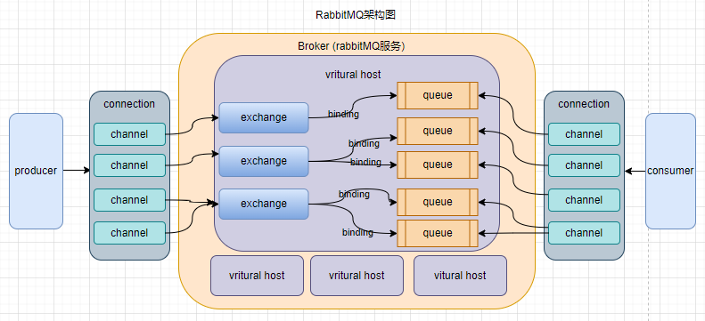
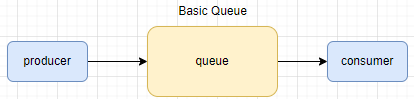
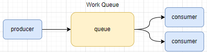

# RabbitMQ

## 1. RabbitMQ简介

    rabbitMQ是由rabbit技术公司基于AMQP标准开发的，采用Erlang语言开发， AMQP协议（Advanced Message Queuing Protocol）高级消息队列协议，是一个网络协议。‘

## 2. RabbitMQ安装

### 2.1 单机版

    基于Docker安装RabbitMQ单机版。需要pull RabbitMQ镜像，尽量选择management版本，例如` rabbitmq:3.9.22-management`  功能齐全，带web管理。

    如果需要挂载数据目录，数据目录/var/lib/rabbitmq

    pull镜像后，创建并启动容器，使用`docker ps` 查看是否启动成功，如果启动失败使用`docker logs -f container-name` 查看启动日志。 

```shell
docker run --name dc-rabbitmq \
-p 5672:5672 -p 15672:15672 -itd \
-e RABBITMQ_DEFAULT_USER=rabbit \
-e RABBITMQ_DEFAULT_PASS=rabbit \
-v /tmp/volume/rabbitmq/data:/var/lib/rabbitmq \
rabbitmq:3.9.22-management 
```

   端口映射，5672是rabbitmq的服务端口号，15672是web管理界面端口号。

## 3 RabbitMQ架构

  rabbitMQ基本架构如下图：



- channel：是用来操作MQ的工具，可以创建队列，发布消息等。

- exchange：交换机，用来将消息路由到对应的queue。有3种类的交换机。

- queue：消息缓存区域。

- virtural host：虚拟主机，对queue，exchange资源的逻辑分组，可以理解为不同的库。

## 4 消息模型

    rabbitMQ常用的有5种消息模型，可以根据不同的业务场景选择不同的模型。包括：基本消息队列、工作消息队列、发布订阅模型。发布订阅又根据exchange不同分为 fanout 、direct、topic。

### 4.1 基本消息队列模型

    基本消息队列模型basicQueue，只包含3个角色 producer，consumer，queue，并且只有一消费者和生产者。该模型比较简单，使用场景也非常少。



    basicQueue用实例：

    公共操作，用户获取rabbitMQ connction的操作

```java
public class RabbitConnection{

    private static final Connection CONNECTION;

    private static final String USERNAME = "rabbit";

    private static final String PASSWORD = "rabbit";

    private static final String RABBIT_HOST = "192.168.56.11";

    private static final int PORT = 5672;
    static {
        ConnectionFactory connectionFactory = new ConnectionFactory();
        connectionFactory.setHost(RABBIT_HOST);
        connectionFactory.setPort(PORT);
        connectionFactory.setUsername(USERNAME);
        connectionFactory.setPassword(PASSWORD);
        Connection connection = null;
        try {
            // 获取TCP长连接
            connection = connectionFactory.newConnection();
        } catch (IOException | TimeoutException e) {
            e.printStackTrace();
        }
        CONNECTION = connection;

    }
    public static Connection getRabbitConnection(){
        return CONNECTION;
    }
}
```

    生产者实例：

```java
@Slf4j
public class BasicQueueProducer {

    public void sendBasic() throws IOException, TimeoutException {
        // 获取rabbit连接
        Connection connection = RabbitConnection.getRabbitConnection();
        // 创建虚拟连接
        Channel channel = connection.createChannel();
        /*
        创建队列
        参数一：队列名称
        参数二：持久化
        参数三：是否队列私有化，false代表所有消费者都可以访问，true代表只有第一个消费者才能一直访问
        参数四：是否自动删除，false代表连接停掉不会删除队列
         */
        channel.queueDeclare("basic_que", false, false, false, null);
        String message = "basic message";
        // 发布消息，不需要指定交换机，mq会提供默认的交换机处理
        channel.basicPublish("", "basic_que", null, message.getBytes());
        log.info("basic消息发送成功");
        channel.close();
        connection.close();
    }
}
```

    消费者实例：

```java
@Slf4j
public class BasicQueueConsumer {

    public void pullBasic() throws IOException, TimeoutException {
        Connection connection = RabbitConnection.getRabbitConnection();
        Channel channel = connection.createChannel();
        // 处理消息，从basic_que队列中出去消息。false手动确认 ack
        channel.basicConsume("basic_que", false, new DefaultConsumer(channel) {
            @Override
            public void handleDelivery(String consumerTag, Envelope envelope, AMQP.BasicProperties properties,
                                       byte[] body) throws IOException {
                log.info("接收到消息，开始处理----------");
                log.info("消息内容：{};消息编号：{}", new String(body), envelope.getDeliveryTag());
                // 确认消息，
                channel.basicAck(envelope.getDeliveryTag(), false);
                log.info("ack suc");
            }
        });
    }
}
```

### 4.2 工作消息队列模型

    工作消息队列模型 workQueue，在basic模型的基础上可以有多个消费者。对于一些数据量比较大的场景，我们可以使用该模型，创建多个消费者同时处理消息。消费者之间是竞争关系，保证消息只被一个消费者消费一次。



    生产者代码与basicqueue基本一致，可以添加配置`channel.basicQos(NUMBER)` 设置每次可以从队列中取出多少条数据，处理完了NUMBER条后，才可以再消费数据。如果不设置则会将数据全部平均分配给每个consumer。

```java
@Slf4j
public class WorkQueueProducer {
    public static final String COLOR_EXCHANGE_ROUTING = "color_exchange_routing";

    public void sendWork() throws IOException, TimeoutException {
        Connection connection = RabbitConnection.getRabbitConnection();
        Channel channel = connection.createChannel();
        channel.queueDeclare("work_que",false,false,false,null);
        // 设置该值后mq不会给消费者将所有平均的消息给消费者，而是处理完一条 再取一条
        // channel.basicQos(1)

        for (int i = 0; i < 10000; i++) {
            String message = "work_mes:"+i;
            channel.basicPublish(""," ",null,("work_mes:"+i).getBytes());
            log.info("send suc message:{}",message );
        }

        channel.close();
        connection.close();
    }
}
```

    消费者代码和basic queue完全一样，可以根据业务创建多个消费者同时去处理消息。

### 4.3 发布订阅模式-
