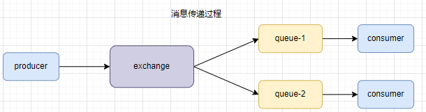
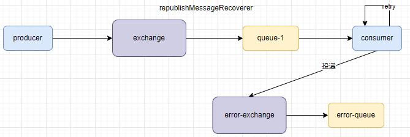
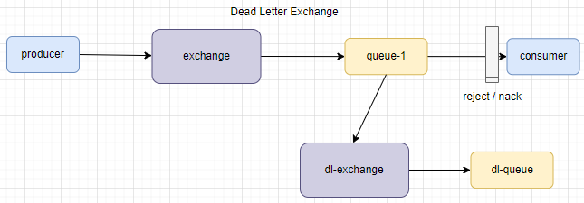
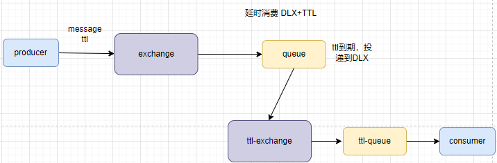

# RabbitMQ高级特性

## MQ常见问题

    mq不仅实现了消息的收发功能，还需要提供一下保障功能，确保消息可靠性，满足不同的业务场景。

    mq常见的一些问题：

- 消息可靠性问题：如何确保消息被至少消费一次

- 延迟消息问题：如何实现消息的延时投递

- 高可用问题： 如何避免单点mq故障导致不可用

- 消息堆积问题：如何解决百万消息堆积，无法及时消费问题

## 1 消息的可靠性

     在rabbitMQ中消息传递过程，从producer投递到指定的exchange，从exchange路由到对应queue，再从queue到consumer。在消息传递几个过程中都有网络连接，都可能会出现故障，**就需要保证消息传递过程的可靠性**。消息传递过程如下图所示：



    如果消息成功传递到queue，我们可以任务消息投递成功了，但是此时消息就一定能可靠了吗？如果此时MQ服务宕机，因为MQ的数据都是存储在内存中的，那么此时数据也会丢失，所以我们还需要**确保MQ不会丢失消息**。

    如果以上情况都没有发生，消息成功传递到consumer，但是如果consumer没有来得及处理消息也宕机了，那么MQ也认为消息被处理了，删除了消息。实际上并没有处理该条消息，造成了消息丢失，**需要确保消费者正确处理了消息**。

    通过以上3种场景，可以总结出rabbitMq可能会导致消息丢失的情况：

- 消息传递时丢失：（生产者确认机制解决）（事务方式解决，效率极低 慎用）
  
  - 消息没有传递到exchange丢失 （publisher-confirm确认机制）
  
  - 消息传递到了exchange，但是没有路由到queue（publisher-returns确认机制）

- MQ服务宕机，导致消息丢失（消息持久化解决）

- 消费者服务宕机，导致消息丢失（消费者确认机制解决 和 消息失败重试机制解决）

    我们只需要解决以上3种rabbitMQ丢失数据的问题，就能确保消息的可靠性。

### 1.1 消息传递时丢失问题（生产者确认机制）

    RabbitMq为了解决消息传递时丢失问题，提供了publisher-confirm机制来确保消息传递过程的可靠性。消息在传递到MQ之后需要给消息发布者一个返回结果，表示消息发送成功。针对消息传递到exchange和路由到queue两个阶段，rabbitMq提供了两个却机制：

- publisher-confirm
  
  - 消息成功投递到exchange，返回ack
  
  - 消息未投递到exchaneg，返回nack

- publisher-return
  
  - 消息没有正确路由到queue时，返回路由，消息等信息

#### 1.1.1 实例

1. 需要在publisher服务中配置开启发布者确认机制

```yaml
spring:
  rabbitmq:
    publisher-confirm-type: correlated
    publisher-returns: true
    template:
      mandatory: true
```

    配置说明

- publisher-confirm-type:开启publisher-confirm确认机制，该属性有三个配置项。
  
  - none: 默认值，不开启发布者确认
  
  - correlated: 表示消息发布到exchage，采用异步回调方式确认
  
  - simple: 支持同步等待（直到超时）waitForConfirms()和waitForConfirmsOrDie() 方法的调用

- publisher-returns:开启publisher-returns确认机制

- template.mandatory:定义消息路由失败时的策略，true时调用ReturnCallback；false时丢弃消息。
2. 确认机制代码

    对于publisher-return机制，rabbitMq要求一个RabbitTemplate实例只能设置一次ReturnCallback。所有我们可以在spring启动阶段配置。

```java
/**
 * publisher-return 处理机制
 * @author zhaixinwei
 * @date 2022/9/21
 */
@Slf4j
@Configuration
public class RabbitMqReturnCallback implements ApplicationContextAware {
    @Override
    public void setApplicationContext(ApplicationContext applicationContext) throws BeansException {
        RabbitTemplate rabbitTemplate = applicationContext.getBean(RabbitTemplate.class);
        rabbitTemplate.setReturnsCallback(returnedMessage -> {
            log.info("message routed queue failed. {}",returnedMessage);
        });
    }
}
```

    对于publisher-confirm机制，rabbitMq没有要求RabbitTemplate实例只能配置一个回调，我们可以在每次发消息前配置回调处理函数。

```java
public void sendAndConfirm() {
        CorrelationData correlationData = new CorrelationData();
        // 设置消息的唯一ID
        correlationData.setId("confirm-1");
        correlationData.getFuture().addCallback(result -> {
            if (result != null && result.isAck()) {
                log.info("message push success:{}", correlationData.getId());
            } else {
                log.error("message push failed:{}", correlationData.getId());
            }
        }, ex -> {
            log.error("exception");
        });

        rabbitTemplate.convertAndSend(RabbitMqConfig.BOOT_EXCHANGE_NAME, "boot.confirm", "confirm", correlationData);
    }
```

### 1.2 消息持久化

    rabbitMq中exchange、queue、message内容都是存储在内存中的。如果rabbitMq重启，宕机后内容会丢失。因此，rabbitMq提供了对于exchange、queue、message的持久化功能。

    我们可以在创建exchange和queue时设置其为持久化方式。通过设置durable属性实现。

```java
// 设置队列的持久化
@Bean("bootQueue")
public Queue bootQueue() {
    return QueueBuilder.durable(BOOT_QUEUE).build();
}

// 设置交换机的持久化
@Bean("bootExchange")
public Exchange bootExchange() {
    // durable:是否持久化
    return ExchangeBuilder.topicExchange(BOOT_EXCHANGE_NAME).durable(true).build();
}
```

    queue的持久化能保证自身元数据不会因为故障丢失数据，但是不能保证内部的message不会丢失，所以message也需要持久化。

```java
Message message = MessageBuilder.withBody("durable".getBytes())
        .setDeliveryMode(MessageDeliveryMode.PERSISTENT) // 设置消息持久化
        .build()
```

> 如果exchange和queue都是durable，那么它们之间的binding也是durable
> 
> 如果exchange和queue其中一个为持久化一个非持久化，不允许建立绑定关系
> 
> 如果exchange或者queue指定了durable就不能被修改

    默认情况下使用springAMQP所有的exchange、queue、message都是开启持久化的。

### 1.3 消费者确认机制

    RabbitMq支持消费者确认机制，消费者处理消息后可以向MQ发送ack回执，MQ收到了ack回执才会删除该消息。SpringAMQP运行配置三种确认模式：

- manula：手动ack，需要在业务代码结束后，调用api发送ack

- auto：自动ack，spring监测Listener代码是否出现异常，如果没有异常返回ack，如果抛出异常返回nack。

- none：关闭ack，MQ假定消费者获取消息后会处理成功，因此投递后立即删除消息

    消息确认机制配置（consumer），推荐使用auto

```yaml
spring: 
  rabbitmq:
    listener:
      simple:
        acknowledge-mode: auto
```

    RabbitMq支持消费者确认机制，默认情况下rabbitMq会自动确认消息，向MQ发送ack，MQ收到ack后才会删除消息。也控制配置手动消息确认

```yaml
spring:
  rabbitmq:
    listener:
      simple:
        acknowledge-mode: manual# 消息确认模式
# 消费者确认机制有3中配置方式
# - auto：自动ack，由spring检测listener代码是否出现异常，没有异常发送ack，抛出异常则返回nack
# - manual：手动ack，需要在业务代码结束后，调用api发送ack
# - none：关闭ack，MQ假定消费者获取消息后会成功处理，因此消息投递后立即被删除
```

    消费者手动确认机制实例：

```java
/**
 * rabbitMq 消费者监听器内容
 * @author zhaixinwei
 * @date 2022/9/19
 */
@Slf4j
@Service
public class RabbitMqListener {
    // 需要配置ackMode属性
    @RabbitListener(queues = "boot_queue", ackMode = "MANUAL")
    public void bootConsumer(Message message, Channel channel) throws IOException {
        long deliveryTag = message.getMessageProperties().getDeliveryTag();
        log.info("{}:consume message:{};properties:{}",deliveryTag,new String(message.getBody()), message.getMessageProperties().toString());
        // 模拟消息手动确认
        if (deliveryTag % 2 == 0) {
            /*
             参数二: multiple，是否确认小于deliveryTag的所有消息，false只确认当前消息
             参数三: requeue，拒绝签收后，消息是否重新回到queue排队
             */
            channel.basicNack(deliveryTag, false, true);
        }else {
            channel.basicAck(deliveryTag, true);
        }
    }
}
```

### 1.4 失败重试机制

    在消费者确认机制中，如果消费者出现了异常，消息会不断requeue到队列重新排队，如果一直出现异常，会导致无限排队，cpu增加压力。 

    可以利用spring的重试机制retry，在消费者出现异常时，利用本地重试，而不是requeue到队列。

    配置开启retry机制

```yaml
spring:
  rabbitmq:
    listener:
      simple:
        retry:
          enabled: true # 开启消费者失败重试
          initial-interval: 1000 # 初始的失败等待时长1秒
          multiplier: 2 # 下次失败的等待时长倍数，下次等待时长=multiplier * last-interval
          max-attempts: 3 # 最大重试次数
          stateless: true # true无状态；false 有状态。如果业务中包含事务，这里改为false
```

    如果消息消耗了所有retry次数后，仍没有被正确处理，默认的处理机制时抛弃消息。spring提供了MessageRecoverer接口来处理retry次数耗尽后的策略：

- RejectAndDontReququeRecoverer：重试耗尽，直接reject，丢弃消息，默认的机制

- ImmediateRequeueMessageRecoverer：重试耗尽后，返回nack，消息重新入队

- RepublishMessageRecoverer：重试耗尽后，将失败消息投递到指定的交换机

    RepublishMessageRecoverer工作机制图：



    定义失败策略方法，以RepublishMessageRecoverer为例，通过spring自动装配原理，自定义一个MessageRecoverer Bean去覆盖默认的MessageRecoverer Bean。

1. 定义error-exchange和erro-queue

```java
public static final String ERROR_EXCHANGE = "error_exchange";
public static final String ERROR_QUEUE = "error_queue";
@Bean("errorExchange")
public Exchange errorExchange(){
    return ExchangeBuilder.topicExchange(ERROR_EXCHANGE).durable(true).build();
}
@Bean("errorQueue")
public Queue errorQueue(){
    return QueueBuilder.durable(ERROR_QUEUE).build();
}
@Bean("errorBinding")
public Binding errorBinding(@Qualifier("errorExchange") Exchange exchange,@Qualifier("errorQueue") Queue queue){
    return BindingBuilder.bind(queue).to(exchange).with("error.#")."error.retry.fail");
}
```

2. 配置失败策略

```java
/**
 * retry机制耗尽次数后的处理策略
 * @return MessageRecoverer
 */
@Bean
public MessageRecoverer messageRecoverer(RabbitTemplate rabbitTemplate){
    return new RepublishMessageRecoverer(rabbitTemplate,ERROR_EXCHANGE,"error.retry.fail");
}
```

## 2 延时消息

### 2.1 死信交换机

    **死信**：当一个队列中的消息满足一下任意情况时，可以成为死信（dead letter）：

- 消费者使用basic.reject或者basic.nack声明消费失败，并且消息的requeue参数设置为false。

- 消息是一个过期消息，超时无人消费

- 要投递的队列消息堆积满了，最早的消息肯成为死信

    死信会被MQ抛弃掉，如果该队列配置了`dead-letter-exchange`属性，指定了一个交换机，那么队列中的死信就会被投递到这个交换机中，这个交换机成为**死信交换机**（dead letter exchange DLX）



    DLX与重试机制失败后的RepublishMessageRecoverer策略很相似，都是将消息投递到另一个交换机中去。其区别在于RepublishMessageRecoverer策略是消费者自己投递的，头顶是需要指定exchange和routingKey；DLX则是由队列投递的，我们在投递消息是指定了`dead-letter-exchange`属性，明确了死信投递的交换机，但是交换机不能存储数据还需要绑定queue，那么exchange怎么知道要路由到那个queue呢？还需要指定属性`dead-letter-routing-key`

    DLX实例：

    创建死信交换机和死信队列

```java
public static final String DEAD_EXCHANGE = "dead_exchange";
public static final String DEAD_QUEUE = "dead_queue";

@Bean("deadExchange")
public Exchange deadExchange(){
    return ExchangeBuilder.topicExchange(DEAD_EXCHANGE).durable(true).build();
}
@Bean("deadQueue")
public Queue deadQueue(){
    return QueueBuilder.durable(DEAD_QUEUE).build();
}
@Bean("deadBinding")
public Binding deadBinding(@Qualifier("deadExchange") Exchange exchange,@Qualifier("deadQueue") Queue queue){
    return BindingBuilder.bind(queue).to(exchange).with("dead.#").noargs();
}
```

    创建投递消息的交换机和队列

```java
@Bean("bootQueue")
public Queue bootQueue() {
    return QueueBuilder.durable(BOOT_QUEUE)
            // 配置死信相关属性
            .deadLetterExchange("dead_exchange")
            .deadLetterRoutingKey("dead.boot")
            .build();
}

@Bean("bootExchange")
public Exchange bootExchange() {
    // durable:是否持久化
    return ExchangeBuilder.topicExchange(BOOT_EXCHANGE_NAME).durable(true).build();
}

@Bean("bindBoot")
public Binding bindBoot(@Qualifier("bootExchange") Exchange exchange, @Qualifier("bootQueue") Queue queue) {
    return BindingBuilder.bind(queue).to(exchange).with("boot.#").noargs();
}
```

    发布消息

```java
public void sendDeadLetter(){
    Message message = MessageBuilder.withBody("dead letter".getBytes())
            .setDeliveryMode(MessageDeliveryMode.PERSISTENT)
            .build();
    rabbitTemplate.convertAndSend(RabbitMqConfig.BOOT_EXCHANGE_NAME,"boot.dead",message);
}
```

    boot队列监听器

```java
@RabbitListener(queues = "boot_queue", ackMode = "MANUAL") // 开启手动确认消息
public void bootConsumer(Message message, Channel channel) throws IOException {
    long deliveryTag = message.getMessageProperties().getDeliveryTag();
    log.info("boot message:{}",new String(message.getBody()));
    // 拒绝消息，会被queue投递到死信队列
    channel.basicReject(deliveryTag,false);
}
```

### 2.2 TTL

    TTL(Time-To-Live)，如果一个队列中的消息在TTL结束后仍没有被消费，则会变成死信，ttl超时分为两种情况：

- 消息所有的queue本身设置了消息存活时间 `x-message-ttl`

- 消息本身设置了存活时间

    利用TTL和死信交换机，可以实现消息的延时消费，如下图所示：



    TTL实例：模拟一个订单超时关闭的场景

    创建orderExchange和orderQueue用于存储订单信息

```java
@Bean("orderExchange")
public Exchange orderExchange(){
    return ExchangeBuilder.topicExchange(ORDER_EXCHANGE).durable(true).build();
}

@Bean("orderQueue")
public Queue orderQueue(){
    return QueueBuilder.durable(ORDER_QUEUE)
            // 设置队列为ttl 单位ms
            .ttl(5000)
            .deadLetterExchange("ttl_exchange")
            .deadLetterRoutingKey("ttl.order")
            .build();
}
@Bean("orderBinding")
public Binding orderBinding(@Qualifier("orderExchange") Exchange exchange,@Qualifier("orderQueue") Queue queue){
    return BindingBuilder.bind(queue).to(exchange).with("order.#").noargs();
}
```

    创建死信交换机 ttl-queue，ttl-exchange

```java
@Bean("ttlExchange")
public Exchange ttlExchange(){
    return ExchangeBuilder.topicExchange(TTL_EXCHANGE).durable(true).build();
}
@Bean("ttlQueue")
public Queue ttlQueue(){
    return QueueBuilder.durable(TTL_QUEUE)
            .build();
}
@Bean("ttlBinding")
public Binding ttlBinding(@Qualifier("ttlExchange") Exchange exchange,@Qualifier("ttlQueue") Queue queue){
    return BindingBuilder.bind(queue).to(exchange).with("ttl.#").noargs();
}
```

     发送订单消息

```java
public void sendOrder(){
    Message message = MessageBuilder.withBody("order-1".getBytes())
            .setDeliveryMode(MessageDeliveryMode.PERSISTENT)
            .build();
    rabbitTemplate.convertAndSend(RabbitMqConfig.ORDER_EXCHANGE,"order.o1",message);
}
```

    死信交换机监听

```java
@RabbitListener(queues = RabbitMqConfig.TTL_QUEUE)
public void delayConsumer(Message message){
    log.info("delay message 关闭订单：{}",new String(message.getBody()));
}
```

    总结：RabbitMq实现延时消息可以通过给queue设置ttl属性和给message设置ttl属性。如果两个都是设置了，以时间短的为准

### 2.3 DelayExchange

    上述通过DLX+TTL实现了RabbitMQ的延时消息功能，但是实际操作比较麻烦
