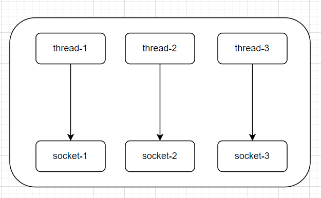
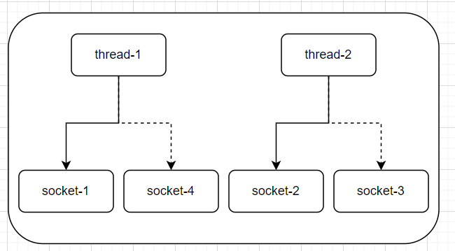
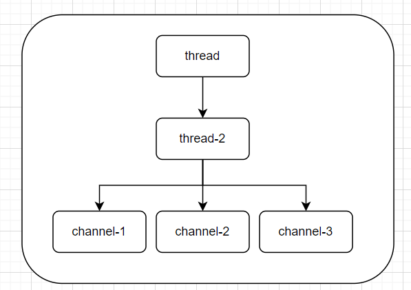
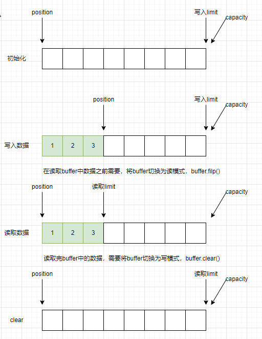
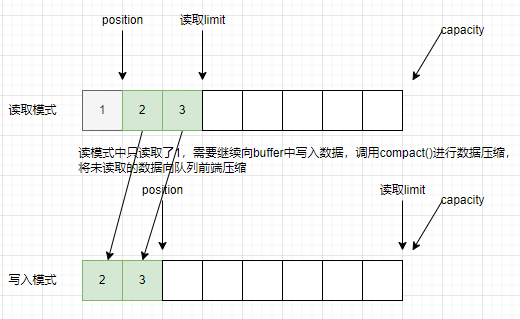

NIO基础

non-blocking io 非阻塞I/O

## 1. NIO三大组件

### 1.1 Channel 和 Buffer组件

channel类似于stream，channel是读写数据的双向通道，可以从buffer中读入数据，也可以将数据写出带channel。而stream只能输入或者输出，channel比stream更底层。

buffer是用于缓冲读写数据。

常见的Channel有：

- FileChannel：文件管道

- DatagramChannel：用于实现UDP连接

- SocketChannel：用于客户端实现TCP连接

- ServerSocketChannel：用于服务端实现TCP连接

常见的Buffer有：

- ByteBuffer：字节缓存，抽象类，其实现类有
  
  - MapperByteBuffer
  
  - DirectByteBuffer
  
  - HeapByteBuffer

- ShortBuffer

- IntBuffer

- LongBuffer

- FloatBuffer

- DoubleBuffer

- CharBugger

### 1.2 Selector

对于Selector的理解可以从服务器端设计的演化过程来理解。

1. 多线程版服务端设计

服务端一般都需要再统一时刻处理多条请求，为了能增加每一时刻处理请求的数量，提高服务端处理能力，就需要引入多线程。理论上线程越多，处理请求能力越强。设计如下图：



但是实际情况并不是线程越多越好，多线程处理存在以下缺点：

- 占用内存高，默认每个线程都会占用1M的内存，如果有大量的线程存在，可能会导致内存不足。

- 线程上下文切换成功较高。线程数超过了CPU核数，CPU就需要切换线程执行。

因此多线程版本的服务端只适用于请求较小的场景，如果存在大量的请求，会造成服务端内存、CPU压力过大。

2. 线程池版服务端设计

线程池的应用可以对创建的线程进行重复利用，避免频繁的创建销毁线程带来的额外开销。虽然解决了线程过多的问题，但是因为socket是阻塞式的，所以每个线程一次仍然只能处理一个请求。



线程池处理存在的缺点：

- 阻塞模式中，线程只能处理一个socket请求

- 仅适合短连接场景，每次请求处理时间较短，不会长时间阻塞线程
3. Seletor版服务端设计

selector的作用是配合一个线程来管理多个channel，获取这些channel上发生的事件，这些channel工作在非阻塞模式下，不会让线程吊在一个channel上，适合连接数较多，但是流量较低场景（low traffic）。



## 2. ByteBuffer

### 2.1 ByteBuffer基本使用

```java
package com.netty.nio;

import lombok.extern.slf4j.Slf4j;

import java.io.FileInputStream;
import java.io.IOException;
import java.nio.ByteBuffer;
import java.nio.channels.FileChannel;
import java.util.Objects;

/**
 * NIO基本使用，读取当前目录一个文件
 *
 * @author zhaixinwei
 * @date 2022/10/25
 */
@Slf4j
public class BasicUse {

    public static void main(String[] args) {
        // 获取输入流channel
        try (FileChannel channel = new FileInputStream(Objects.requireNonNull(BasicUse.class.getClassLoader().getResource("tmp.txt")).getFile()).getChannel()) {
            // 定义buffer，并设置buffer缓冲区大小 10byte。用于存储你channel读取的数据。buffer初始为写入模式
            ByteBuffer buffer = ByteBuffer.allocate(10);

            while (true) {
                // 从channel读取数据，放入缓冲区buffer中
                int len = channel.read(buffer);
                log.debug("read len:{}",len);
                if (-1 == len) {
                    break;
                }
                // 设置buffer为读模式
                buffer.flip();
                // 从buffer中读取数据
                while(buffer.hasRemaining()){
                    // 从buffer中读取数据
                    byte content = buffer.get();
                    log.info("NIO read content:{}",(char)content);

                }
                // buffer需要继续存储缓冲数据，将buffer设置为写模式
                buffer.clear();
            }
        } catch (IOException e) {
            e.printStackTrace();
            log.error("NIO read file error");
        }
    }
}

```

### 2.2 ByteBuffer内部结构

ByteBuffer是一个顺序队列，主要包含三个属性：

- capacity：队列容量

- position：待操作位置指针

- limit：读取或者写入最大限制

ByteBuffer在使用时，内部结构实现原理如下图：



上图中所示的情况，每次都将buffer中的数据全部读出。实际业务中可能存在没有将buffer中的数据全部读出，就要继续向Buffer中写入数据，这种情况的处理如下图：



### 2.3 ByteBuffer常用方法

1. 为buffer分配内存空间

```java
// 为buffer分配，jvm堆内存空间
ByteBuffer buffer = ByteBuffer.allocate(10);
// 为buffer分配，直接内存空间
ByteBuffer bufferDirect = ByteBuffer.allocateDirect(10);
```

allocate()方法返回的类为`java.nio.HeapByteBuffer`。使用的是jvm堆内存空间。

allocateDirect()方法返回的类为`java.nio.DirectByteBuffer`，使用的是直接内存。

堆内存和直接内存的区别：

- 堆内存：读写效率低（多一次拷贝）；会受到GC影响

- 直接内存：读写效率高；不受GC影响；分配内存效率较低
2.  向buffer中写入数据

```java
// 2. 向buffer中写入数据
// 从channel中写入buffer
FileChannel channel = new FileInputStream("tmp.txt").getChannel();
channel.read(buffer);
// 调用put方法写入buffer
buffer.put((byte) 0x61);
```

- 可以通过channel的read方法向buffer中写入数据

- 也可以调用buffer自己的put方式写入数据。
3.  从buffer中读取数据

```java
 // 3. 从buffer中获取数据
 // 将buffer数据写出到channel
 channel.write(buffer);
 // get方法获取buffer中数据
 buffer.get();
 // 重置position为0，重新从0开始读取数据
 buffer.rewind();
 // mark()和reset()方法，mark对position的位置做一个标记，reset将position重置到mark位置
 buffer.mark();
 buffer.reset();
 // 通过get(index)方法获取任意所有内容，不会影响position
 buffer.get(3);
```

- 调用channel的write方法将buffer数据读出，写入到channel

- 调用buffer自己的get方法。get方法会让position指针往后走，如果想要重复读取数据，操作如下：
  
  - 调用buffer.rewind()方法将position重置为0
  
  - 调用buffer.get(int index)方法获取索引位置的内容，该方法不会移动读指针
4. ByteBuffer与字符串之间相互转换
- 字符串转ByteBuffer

```java
// 字符串转ByteBuffer
// 原始方式
ByteBuffer buffer1 = ByteBuffer.allocate(10);
buffer1.put("hello".getBytes(StandardCharsets.UTF_8));
// 标准CharSet方式，会直接将buffer切换到读模式
ByteBuffer buffer2 = StandardCharsets.UTF_8.encode("hello");
// warp方法，会直接将buffer切换到读模式
ByteBuffer buffer3 = ByteBuffer.wrap("hello".getBytes(StandardCharsets.UTF_8));
```

- ByteBuffer转为字符串

```java
StandardCharsets.UTF_8.decode(buffer1);
```

### 2.4 ByteBuffer黏包和半包

例：一下三条消息需要通过网络进行传输，为了区分消息，每条消息通过\n进行分割。

> Hello,world\n
> 
> I'm zhangsan\n
> 
> How are you\n

但是由于某些原因这些数据在被接收时，会被重新组合，例如变成两个byteBuffer。

> Hello,world\nI'm zhangsan\nHo
> 
> w are you\n

这种情况被称为网络黏包和半包。黏包是指多条完整的消息被重新组合为一个byteBuffer；半包是指一条消息被重新组合进两个不同的byteBuffer。

黏包现象的产生是在网络发送时的一种优化，将多条消息同时发送，提供传输效率。

半包现象是由于接收方缓冲区大小决定的，缓存区大小可能恰好将一条消息分为两部分。

拆包实现，解决黏包和半包问题。

```java
package com.netty.nio.bytebuffer;

import lombok.extern.slf4j.Slf4j;
import java.nio.ByteBuffer;
import java.nio.charset.StandardCharsets;
/**
 * 模拟网络传输时的黏包现象，并进行拆包解决问题
 *
 * @author zhaixinwei
 * @date 2022/10/25
 */
@Slf4j
public class Unpacking {

    public void unpack() {
        // 接收端缓存
        ByteBuffer source = ByteBuffer.allocate(32);

        // 模拟接收数据黏包，拆包现象
        source.put("Hello,world\nI'm zhangsan\nHo".getBytes(StandardCharsets.UTF_8));
        split(source);
        source.put("w are you\n".getBytes(StandardCharsets.UTF_8));
        split(source);
    }

    private void split(ByteBuffer source) {
        // 切换为读模式
        source.flip();
        // 遍历每一个字节，进行拆包
        for (int i = 0; i < source.limit(); i++) {
            if ('\n' == source.get(i)) {
                // 一个完整的数据
                int length = i + 1 - source.position();
                ByteBuffer target = ByteBuffer.allocate(length);
                // 从source读取数据写入target
                for (int j = 0; j < length; j++) {
                    target.put(source.get());
                }
                target.flip();
                log.debug("message: {}",StandardCharsets.UTF_8.decode(target).toString());
            }
        }
        // 本次没有读取完source中的内容，进行数据压缩
        source.compact();
    }

    public static void main(String[] args) {
        new Unpacking().unpack();
    }
}

```

## 3. NIO文件编程

### 3.1 FileChannel

FileChannel只能工作在**阻塞模式**下，不能使用Selector。

1. FileChannel的获取
- 通过FileInputStream获取的channel只能读

- 通过FileOutputStream获取的channel只能写

- 通过RandomAccessFile可以获取能读写的channel
2. 从channel读取数据

以下代码会从channel中读取数据填充到buffer，返回值表示读取了多少字节，-1到了文件末尾，没有读取到数据。

```java
int len = channel.read(buffer);
```

3. 写入数据到channel

```java
ByteBuffer buffer = ...;
buffer.put();
buffer.filp();
// 使用循环buffer.hasRemaining，保证可以将buffer的数据都写入到channel
while(buffer.hasRemaining) {
    channel.write(buffer);
}
```

4. channel位置

```java
// 获取当前位置
long pos = channel.position();
// 设置当前位置
channel.position(position);
```

5. 强制写入

channel的write()方法，并不会直接将数据写入磁盘，操作系统处理性能考虑，而是将数据缓存。可以调用force(true)将文件内容和元数据立即希尔磁盘。

## 4. 网络编程
