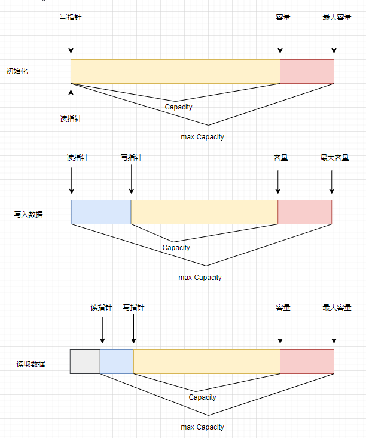

## 1. 概述

## 2. hello world

netty实现服务端

```java
package com.netty.hello;

import io.netty.bootstrap.ServerBootstrap;
import io.netty.channel.ChannelHandlerContext;
import io.netty.channel.ChannelInboundHandlerAdapter;
import io.netty.channel.ChannelInitializer;
import io.netty.channel.nio.NioEventLoopGroup;
import io.netty.channel.socket.nio.NioServerSocketChannel;
import io.netty.channel.socket.nio.NioSocketChannel;
import io.netty.handler.codec.string.StringDecoder;
import lombok.extern.slf4j.Slf4j;

/**
 * 使用netty实现hello world网络服务端
 *
 * @author zhaixinwei
 * @date 2022/10/27
 */
@Slf4j
public class HelloServer {

    public static void main(String[] args) {
        // 1. 服务端启动类
        new ServerBootstrap()
                // 2. 添加eventLoop，真正去处理事件的组件
                .group(new NioEventLoopGroup())
                // 3. 选择channel实现
                .channel(NioServerSocketChannel.class)
                // 4. 添加处理器
                .childHandler(new ChannelInitializer<NioSocketChannel>() {
                    @Override
                    protected void initChannel(NioSocketChannel nioSocketChannel) throws Exception {
                        // pipeline工作流程管道
                        nioSocketChannel.pipeline().addLast(new StringDecoder());
                        nioSocketChannel.pipeline().addLast(new ChannelInboundHandlerAdapter() {
                            @Override
                            public void channelRead(ChannelHandlerContext ctx, Object msg) throws Exception {
                                log.debug("msg:{}", msg);
                            }
                        });
                    }
                }).bind(8899);
    }
}
```

netty实现客户端

```java
package com.netty.hello;

import io.netty.bootstrap.Bootstrap;
import io.netty.channel.ChannelInitializer;
import io.netty.channel.nio.NioEventLoopGroup;
import io.netty.channel.socket.nio.NioSocketChannel;
import io.netty.handler.codec.string.StringEncoder;
import lombok.extern.slf4j.Slf4j;

import java.net.InetSocketAddress;

/**
 * @author zhaixinwei
 * @date 2022/10/27
 */
@Slf4j
public class HelloClient {
    public static void main(String[] args) throws InterruptedException {
        new Bootstrap()
                .group(new NioEventLoopGroup())
                .channel(NioSocketChannel.class)
                .handler(new ChannelInitializer<NioSocketChannel>() {
                    @Override
                    protected void initChannel(NioSocketChannel nioSocketChannel) throws Exception {
                        nioSocketChannel.pipeline().addLast(new StringEncoder());
                    }
                })
                .connect(new InetSocketAddress(8899))
                .sync()
                .channel()
                .writeAndFlush("hello netty");
    }
}
```

## 3. 组件

### 3.1 EventLoop

EventLoop（事件循环对象）本质是一个单线程执行器，维护了一个Selector。其线程任务（#run()方法）就是处理Channel上源源不断的IO事件。

EventLoop继承关系比较复杂：

- 一条线继承自j.u.cScheduleExecutorService，包含了线程池中所有的方法。

- 一条线继承自netty自己的OrderedEventExecutor。

EventLoopGroup（事件循环组）是一组EventLoop，Channel一般会调用EventLoopGroup的register方法来绑定其中一个EventLoop，后续这个Channel上的IO事件都由EventLoop来处理（保证率IO事件处理室的线程安全）,。

### 3.2 Channel

### 3.3 Future & Promise

### 3.4 Handler &  Pipeline

### 3.5 ByteBuf

4. ByteBuf的组成

Netty中ByteBuf由四部分组成：读指针；写指针；容量；最大容量



ByteBuf有默认容量，如果存储容量超过默认容量后，回触发ByteBuf扩容，当然ByteBuf也有最大容量限制。ByteBuf读写通过不同的指针来实现，开始时读写指针都在0位置。

扩容规则：例如要写入一个int类型数据（占4个字节）。发现容量不够，就会引发扩容。

- 如果写入后数据大小未超过512，则选择下一个16的整数倍，例如写入后大小为12，则扩容后容量为16。

- 如果写入后数据大小超过512，则选择下一个2^n，例如写入后大小为513，扩容后容量2^10 = 1024。

- 扩容不能超过max capacity。maxcapacity = Integer.MAX_VALUE。
5. ByteBuf的内存回收

不同实现方式的ByteBuf，内存回收释放的方式也是不同的。

- UnpooledHeapByteBuf使用的是JVM内存，只需要等待JVM触发GC即可回收内存；

- UnpooledDirectByteBuf使用的就是直接内存，需要特使的方法来回收内存；

- PooledByteBuf和它的子类使用了池化机制，需要更复杂的规则来回收内存；

ByteBuf内存回收的方法：`protected abstract void deallocate()`

Netty中使用了引用计数法来控制回收内存，每个ByteBuf都实现了ReferenceCounted

- 每个ByteBuf对象的初始计数为1；

- 调用#release方法计数减1，如果计数为0，ByteBuf内存将被回收；

- 调用#retain方法计数加1；

- 当计数为0时，底层内存将回被回收，这时即使ByteBuf对象还早，也无法被正常使用；

谁需要调用ReferenceCounted#release()?

一般ByteBuf需要在Pipeline传递，由不同的ChannelHandler处理。那么由那个ChannelHandler负责完成对ByteBuf的内存释放呢？

基本规则是那个Handler最后处理ByteBuf，就由那个Handler负责release。注意这里是那个Handler最后处理，而不是最后一个Handler。

另外Netty为我们提供了Pipeline的head和tail；head具有释放write事件的ByteBuf，tail可以释放read事件的ByteBuf。
