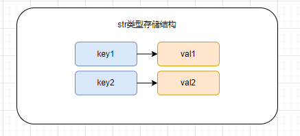
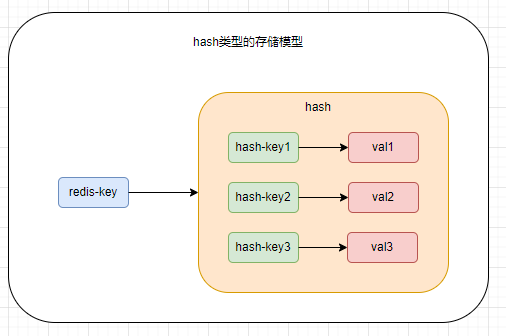
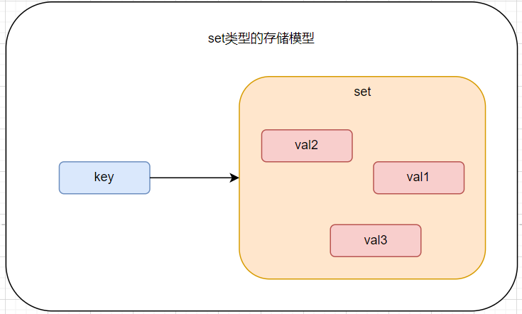
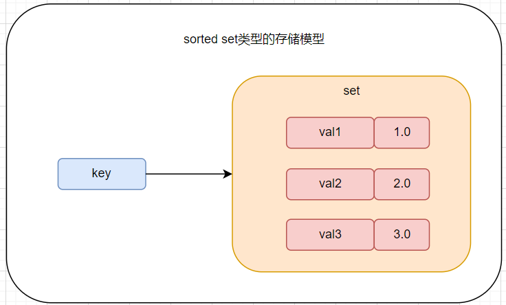

# Redis基础

    redis的数据类型和常用命令：[redis中文网站](https://www.redis.net.cn/tutorial/3501.html)

## 1 Redis数据类型和常用命令

    redis是基于k-v键值对存储的非关系型数据库。根据存在值(v)的不同，redis提供了5种基本数据类型，包括：str，list，hash，sets，zset(sorted sets)。

### 1.1 str类型

    str是字符类型数据，可以存储任意字符串，str类型值最大容量为512M。

#### 1.1.1 str类型的存储模型

    str存储模型比较简单，就是简单的k-v，一个key对应一个字符串值。



#### 1.1.2 str类型常用命令

```shell
# 存储一个str类型的数据, 如果KEY存在则会覆盖原值
setKEY VALUE
# 只有当key值不存在时才会存储 
setnx KEY VALUE
# 存储多个str类型的数据，使用
mset KEY VALUE [KEY VALUE...]

# 从redis中获取一个str类型的数据，
get KEY
# 从reids中一次获取多个str类型的数据，
mget KEY [KEY...]
# 给key设置一个新值，并返回之前的旧值 （如果之前不存在key，返回nil）
getset KEY VALUE
# 返回该字符的子串，(含头含尾)
getrange KEY START END 
# 获取str类型的字符长度
strlen KEY

# 存储有过期时间的str类型 SECOUND单位为妙
setex KEY SECOUND VALUE
# 存储毫秒级别过期时间的str类型 
psetex KEY MILLISECOUND VALUE

# 自增一并返回新值，如果str值是一个数值类型,如果非数值类型error
incr KEY
# val增加指定值返回新值
incrby KEY INCREMENT
# 给key加上指定浮点值
incrbyfloat KEY INCREMENT

# 自减一返回新值
decr KEY    
# val减去指定值返回新值
decrby KEY DECREMENT

# str类型，如果key存在可以为val追加值
append KEY VALUE
```

### 1.2 list类型

    list类型用于存储顺序型数据的结构。每个list最多可以包含2^32-1个元素（大约40亿个）

#### 1.2.1 list类型的存储模型


#### 1.2.2 list类型常用命令

```shell
# 向list左端插入数据
lpush KEY ELEMENT[ELEMENT...] 
# 向list右端插入数据
rpush KEY ELEMENT[ELEMENT...]
# 在指定的元素前|后插入数据 (字符类型需要加引号)
linsert KEY BEFORE|AFTER EXISTING_VALUE NEW_VALUE
# 通过索引set元素值
lset KEY INDEX VALUE
# 为已存在的list添加元素
rpushx|lpushx KEY VALUE

# 从list左端移除数据
lpop KEY [COUNT]
# 从list右端移除数据
rpop KEY [COUNT]
# 从list移除count个指定值
# count>0从左向右移除count个元素，count<0从右向左移除count个元素
lrem KEY COUNT ELEMENT
# 保留指定范围的元素，两边的元素全部移除
ltrim KEY START END

# 从list中获取指定范围的数据 (含头含尾)
lrange KEY START STOP
# 获取list长度(元素个数)
llend KEY 
# 通过索引获取list中的元素 (超出索引返回nil)
lindex KEY index
```

### 1.3 hash类型

    hash类型就是常见的map形式k-v形式，redis本身也是通过k-v形式存储的，所以hash的存储形式类似key-(key1-v1;key2-v2)

#### 1.3.1 hash类型的存储模型



#### 1.3.2 hash类型常用命令

```shell
# 为hash设置值
hmset|hmset KEY FIELD VALUE [FIELD VALUE...]
# 当属性值不存在是给hash设置字段值
hsetnx KEY FIELD VALUE

# 获取hash中属性的值
hget KEY FIELD
# 获取hash中多个属性的值
hmget KEY FIELD [FIELD...]
# 获取hash中所有的属性值
hgetall KEY    
# 查看hash表中是否有field存在
hexists KEY FIELD 
# 获取hash中所有的FIELD
hkeys KEY 
# 获取hash中所有的值
hvals KEY  
# 获取hash字段数量
hlen KEY

#  删除一个或多个hash属性
hdel KEY FIELD [FIELD...]
```

### 1.4 set类型

    set类型是用于存储str类型的无序集合，集合成员唯一，set实现通过hash实现的，所有添加、删除操作时间复杂度都为O(1)。

#### 1.4.1 set类型的存储模型



#### 1.4.2 set类型常用命令

```shell
# 为set集合添加一个|多个成员
sadd KEY MEMBER1 [MEMBER2...]

# 获取集合成员数
scard KEY
# 返回集合中的所有成员
smembers KEY
# 元素是否存在集合中
sismember KEY MEMBER

# 随机移除并返回集合一个|多个元素
spop KEY [COUNT]
# 随机返回集合中一个|多个元素
srandmember KEY [COUNT]
# 移除集合中一个|多个元素
srem KEY MEMBER1 [MEMBER2]
# 将元素移除到另一个集合
smove SOURCE DESTINATION MEMBER

# 返回集合与给定集合的差集 (属于A不属于B的成员)
sdiff KEY1 [KEY2]
# 返回差集存储在新集合中destination
sdiffstore destination KEY1 [KEY2]
# 返回集合与给的集合的交集
sinter KEY1 [KEY2]
# 返回交集存储在新集合中
sintersotre destination KEY1 [KEY2]
# 返回集合与给定集合的并集
sunion KEY1 [KEY2]
# 返回并集存储在新集合中
sunionstory destination KEY1 [KEY2]
```

### 1.5 sorted set类型

    sorted set类型与set类型基本一致，通过给每个元素关联一个double类型的分数，实现排序功能。分数可以重复

#### 1.5.1 sorted set类型的存储模型



#### 1.5.2 sorted set类型常用命令

```shell
# 向集合中添加一个|多个成员
zadd KEY SCORE1 MEMBER1 [SCORE2 MEMBER2...]

# 对集合中指定成员分数增加increment
zincrby KEY INCREMENT MEMBER

# 获取集合成员数
zcard KEY
# 通过索引获取指定区间的成员
zrange KEY START STOP [WITHSOCRES]
# 通过分数值区间返回成员
zrangebyscore KEY MIN MAX [WITHSOCRES] [LIMIT]
# 计算在指定分数区间的成员数
zcount KEY MIN MAX
# 返回有序集合中指定成员的索引
zrank KEY MEMBER
# 返回集合中指定元素的分数
zscore KEY MEMBER

# 移除集合中一个或|多个元素
zrem KEY MEMBER [MEMBER]
```

## 2 Redis持久化

    redis的数据是基于内存存储的，这样可以极高的提高其性能。但是也存在数据丢失的风险，如果redis服务宕机，那么所有的数据都会丢失。

    redis提供了持久化功能，有RDB（Redis DataBase）方式和AOP（Append Only File）方式。

### 2.1 RDB持久化

    RDB方式的持久化是一种数据快照方式，可以理解redis的数据直接持久化到磁盘，不过为了节省空间，RDB存储的是一个二进制文件（默认为dump.rdb文件）。

#### 2.1.1 RDB配置

```vim
# 持久化数据存储目录
data /data

# rdb存储文件名
dbfilename dump.rdb

# 自动保存策略,有该配置自动开启保存，注释掉关闭
save 900 1 # 如果在900秒内，数据改变1次触发持久化
save 90 100 # 如果在90秒内，数据改变100次触发持久化

# 是否压缩rdb文件 默认yes
rdbcompression yes
```

#### 2.1.2 RDB触发方式

    **如果配置了自动触发生成rdb，会使用bgsave方式**

     除了上述自动配置触发，也可以手动出发。

- save命令：redis-cli 执行save命令，阻塞式的

- bgsave命令：redis-cli 执行bgsave命令，非阻塞式的

    save命令的执行会阻塞redis主进程，影响其他数据操作，如果数据量过大，等待时间较长，不推荐使用；执行bgsave命令时redis主进程会fork一个进程（极少时间的阻塞），之后持久化操作都由fork的进程完成。

    bgsave持久化原理是写时复制技术（COPY-ON-WRITE,COW）,bgsave子进程由主进程fork生成，与主进程共享主进程内存数据。bgsave将主进程数据读取写入到磁盘临时文件，等到执行完成后将原有rdb文件覆盖。

#### 2.1.3 RDB优缺点

- 优点

    RDB方式最大的优点是数据恢复速度快，将rdb文件放在data目录下启动redis-server就能直接将数据加载到内存。

- 缺点

    RDB方式最大的确定是会造成数据丢失，RDB自动触发是通过触发策略配置的，在达到触发条件宕机会丢失大量的数据。

### 2.2 AOF持久化

    AOF持久化方式是将redis执行过的一条条命令直接保存，在服务器故障后，重启服务再次执行这些命令恢复数据。

    
