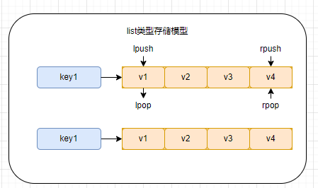

# Redis基础

    redis的数据类型和常用命令：[redis中文网站](https://www.redis.net.cn/tutorial/3501.html)

## 0 Redis基本介绍

## 1 Redis数据类型和常用命令

    redis是基于k-v键值对存储的非关系型数据库。根据存在值(v)的不同，redis提供了5种基本数据类型，包括：str，list，hash，sets，zset(sorted sets)。

### 1.1 str类型

    str是字符类型数据，可以存储任意字符串，str类型值最大容量为512M。

#### 1.1.1 str类型的存储模型

    str存储模型比较简单，就是简单的k-v，一个key对应一个字符串值。


#### 1.1.2 str类型常用命令

```shell
# 存储一个str类型的数据, 如果KEY存在则会覆盖原值
setKEY VALUE
# 只有当key值不存在时才会存储 
setnx KEY VALUE
# 存储多个str类型的数据，使用
mset KEY VALUE [KEY VALUE...]

# 从redis中获取一个str类型的数据，
get KEY
# 从reids中一次获取多个str类型的数据，
mget KEY [KEY...]
# 给key设置一个新值，并返回之前的旧值 （如果之前不存在key，返回nil）
getset KEY VALUE
# 返回该字符的子串，(含头含尾)
getrange KEY START END 
# 获取str类型的字符长度
strlen KEY

# 存储有过期时间的str类型 SECOUND单位为妙
setex KEY SECOUND VALUE
# 存储毫秒级别过期时间的str类型 
psetex KEY MILLISECOUND VALUE

# 自增一并返回新值，如果str值是一个数值类型,如果非数值类型error
incr KEY
# val增加指定值返回新值
incrby KEY INCREMENT
# 给key加上指定浮点值
incrbyfloat KEY INCREMENT

# 自减一返回新值
decr KEY    
# val减去指定值返回新值
decrby KEY DECREMENT

# str类型，如果key存在可以为val追加值
append KEY VALUE
```

### 1.2 list类型

    list类型用于存储顺序型数据的结构。每个list最多可以包含2^32-1个元素（大约40亿个）

#### 1.2.1 list类型的存储模型



#### 1.2.2 list类型常用命令

```shell
# 向list左端插入数据
lpush KEY ELEMENT[ELEMENT...] 
# 向list右端插入数据
rpush KEY ELEMENT[ELEMENT...]
# 在指定的元素前|后插入数据 (字符类型需要加引号)
linsert KEY BEFORE|AFTER EXISTING_VALUE NEW_VALUE
# 通过索引set元素值
lset KEY INDEX VALUE
# 为已存在的list添加元素
rpushx|lpushx KEY VALUE

# 从list左端移除数据
lpop KEY [COUNT]
# 从list右端移除数据
rpop KEY [COUNT]
# 从list移除count个指定值
# count>0从左向右移除count个元素，count<0从右向左移除count个元素
lrem KEY COUNT ELEMENT
# 保留指定范围的元素，两边的元素全部移除
ltrim KEY START END

# 从list中获取指定范围的数据 (含头含尾)
lrange KEY START STOP
# 获取list长度(元素个数)
llend KEY 
# 通过索引获取list中的元素 (超出索引返回nil)
lindex KEY index
```

### 1.3 hash类型

    hash类型就是常见的map形式k-v形式，redis本身也是通过k-v形式存储的，所以hash的存储形式类似key-(key1-v1;key2-v2)

#### 1.3.1 hash类型的存储模型


## 2 Redis持久化

## 3 Redis高可用
