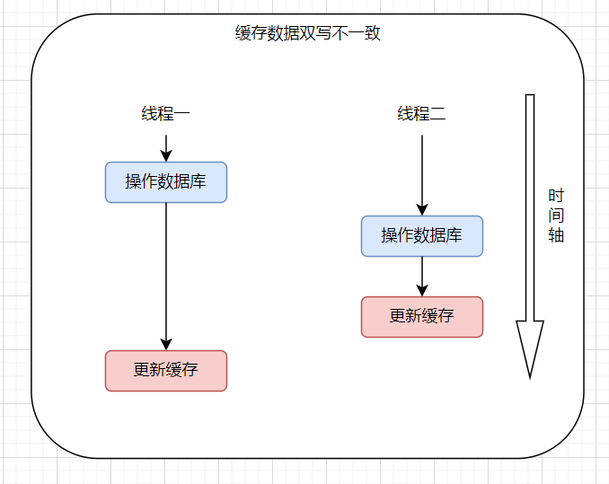
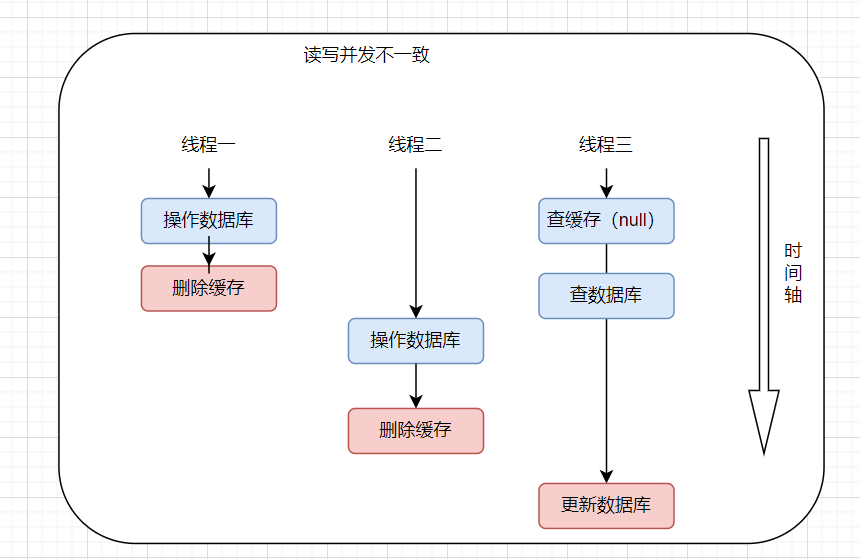

# 缓存设计

## 1 缓存穿透

    缓存穿透是指查询**一条不存在的数据**，缓存层和存储层都不会命中。

    通过出于容错考虑，如果存储层查不到的数据，不会写入缓存层中。就会出现缓存穿透，每次请求都需要去存储层进行查询，失去了包含存储层意义。

    造成缓存穿透的原因：

- 自身业务代码或者数据出现问题

- 恶意攻击，通过大量空命中查询给存储层压力

### 1.2 缓存穿透解决方案

1. 缓存空对象

    将缓存层和存储层中都没有查询到的数据也写入缓存，一定需要设置一个合适的过期时间

```java
// 缓存空对象例子
Object get(String key){
    Object cache = redis.get(key);

    if (null == cache) {
        cache = mysql.get(key);
        redis.set(key,cache);
        if(null == cache){
            redis.expire(key, 300);
        }
    }
    return cache;
}
```

2. 使用布隆过滤器

## 2 缓存击穿（缓存失效）

    缓存击穿是指**大量热点数据在同一时间失效**，大量的请求同时请求失效数据，所有的请求都要去存储层查询，数据库瞬间压力增大。

### 2.1 缓存击穿解决方案

    在批量增加缓存时，需要将这一批缓存的过期时间设置为一个时间段内的不同时间。

```java
// 缓存设置过期时间例子 固定时间+随机时间
Object get(String key){
    Object cache = redis.get(key);

    if (null == cache) {
        cache = mysql.get(key);
        redis.set(key,cache);
        if(null == cache){
            long expireTime = 300 + Radom.nextInt(300);
            redis.expire(key, expireTime);
        }
    }
    return cache;
}
```

## 3 缓存雪崩

    缓存雪崩是指缓存层故障或者宕机，所有的请求都流向后端服务，失去了缓存层承载大量流量，后端服务也会支撑不住并发量造成宕机。

### 3.1 缓存雪崩解决方案

1. 保证缓存层服务高可用（例如使用redis cluster）

2. 使用隔离组件为后端限流熔断并降级（例如使用sentinel和hystrix）

3. 需要提前演练设定缓存雪崩预定方案

## 4 热点缓存

## 5 缓存数据库双写不一致

    在较高的并发下，可能会出现缓存与数据库双写不一致，也就是缓存与数据库存储的时间不一致。一般发生在多个线程同时写数据之后。

    例如：有线程一和线程二同时段不同时刻先后写同一数据，线程一先执行任务，线程一写完数据库后继续写如缓存，在这期间发生了网络故障或阻塞，期间线程二完成了对数据库的操作，写入了缓存，线程二恢复将数据写入缓存。就出现缓存和数据库不一致，缓冲存储的是线程二的数据，而数据库存储的是线程一数据。



### 5.1 解决方案

    对于缓存不一致问题很难有效的解决，需要根据实际业务场景在一致性与并发性做取舍。

- 对于并发量极小的数据（比如：个人数据），几乎不用考虑缓存不一致问题，也可以给缓存加上过期时间。

- 并发很大的情况下，也需要考虑业务数据是否能容忍短时间的缓存不一致，如果可以给缓存加上过期时间。

- 业务数据需要保存强一致性是，可以加锁保证数据一致性，可以通过加读写锁来优化。

- 开源环境canal，是阿里的开源框架用于解决缓存不一致问题，通过监听数据的binlog日志，在其变动后及时去修改缓存。

- 一种常见的解决方案是更新数据库后删除缓存，不更新缓存，读取

时再写入缓存。但是这种方案可能造成读写并发不一致。

    可以看到下图，线程三最够更新到缓存的数据是线程一的数据，与实际数据出现了不一致。



# 性能优化

## 1 开发规范

1. key名设计：key名要有一定的可读性，建议`业务名:表名:id` 来表示，防止key冲突。也可以在保证key语义的情况下简化字符长度。

2. value设计：拒绝使用bigkey，会造成网络阻塞和慢查询。

> bigkey定义: bigkey是指存储的值较大而不是key。
> 
> 一般一下情况会认为是bigkey
> 
> - 字符串类型，单个value值大于10kb
> 
> - 多元素类型，主要体现在元素个数过多，一般单个元素在10kb，元素个数超过5000个。

    非字符串的bigkey不要使用del删除，而是要使用hscan、sscan、zscan渐进式删除。注意自动过期自动删除出会触发del删除。

    bigkey的产生主要是由于程序设计不当，或者对数据规模预估不清晰。

    如果bigkey不可一避免的情况下如果优化呢？

- 针对list类型的bigkey尽可能拆解成多个list

- 针对hash类型的bigkey可以分段存储，使用多个redis-key存储
3. 严格控制key的生命周期，在使用expire设置过期时间时尽量打伞过期时间，防止集中过期。

## 2 命令使用

1. 使用O(n)复杂度的命令

2. 禁用命令，线上环境禁止使用keys、flushdb、flushall等命令，可以通过redis的rename改名。

3. 不推荐使用redis多数据库切换select 命令

4. 操作多个元素时，使用批量操作。（批量操作元素大约在500以内，结合实际情况bigkey更少）

5. 使用lua脚本代替redis事务

## 3 客户端使用

1. 实际业务中，避免多个应用使用同一个redis实例。

2. 代码中，使用带有连接池的客户端。连接池的常见配置如下：

| 参数名      | 解释             | 默认值 | 建议                                        |
| -------- | -------------- | --- | ----------------------------------------- |
| maxTotal | 资源池中最大连接数      | 8   | 应用个数\*maxTotal < redis最大连接数 maxClients    |
| maxIdle  | 资源池允许的最大空闲连接数  | 8   | maxIdle是真正的最大连接数不能设置过小建议maxIde = maxTotal |
| minIdle  | 资源池中确保最小的空闲连接数 | 0   | 资源池最少保存的连接数                               |

    如果应用启动后就会有大量的请求访问，需要给redis连接池做**预热**

执行ping()命令，使连接池的连接数到达minIdle个。

# 淘汰策略

    Redis设计了三种过期淘汰策略：

1. 被动删除：当读/写一个过期的key，才会惰性触发删除策略，删除这个过期的key

2. 主动删除：惰性删除无法保证冷数据被及时的清理掉，Redis还会定期主动去淘汰已过期的key

3. Redis内存超过了maxmemory时，会触发主动清除策略，主动清除策略一共有8种：
   
   - 针对设置了过期时间的key处理：
     
     - volatile-ttl：在筛选时，会根据过期时间的先后进行删除，先删除越早过期的的。
     
     - volatile-random：随机删除设置了过期时间的值
     
     - volatile-lru：删除最近最少使用的设置了过期时间的值
     
     - volatile-lfu：删除最不经常使用的设置了过期时间的值
   
   - 针对所有Key的处理：
     
     - allkeys-random：随机删除
     
     - allkeys-lru：LRU算法删除
     
     - allkeys-lfu：LFU算法删除
   
   - 不处理：
     
     - noevictioin：不会提出任何数据，拒绝所有写入操作并返回客户端错误
